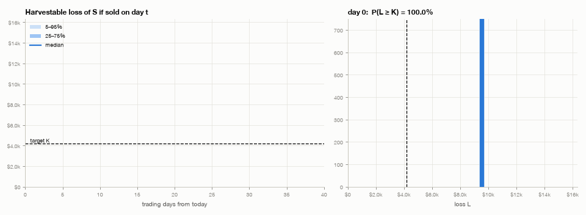
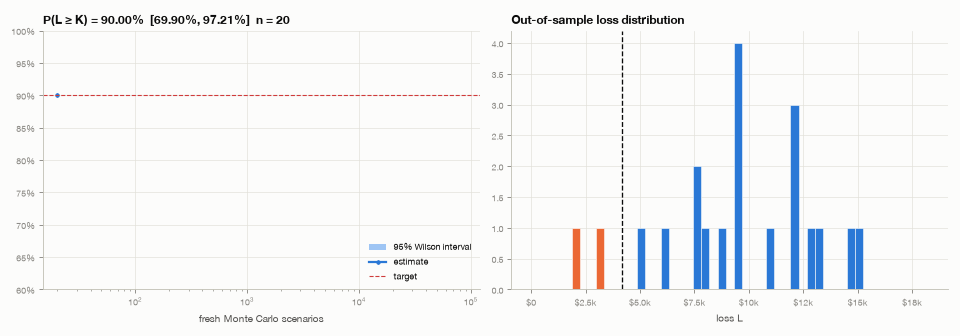
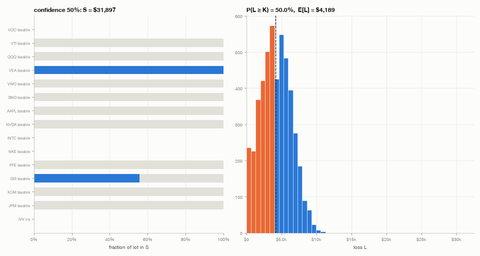

# TaxHarvest

Given a portfolio **P** with a return distribution **F_P**, pick the smallest sub-portfolio
**S** of tax lots to sell at a loss, such that:

* the realised loss **L** reaches a target **K = tax rate × E[gains]** with a chosen
  confidence, **P(L ≥ K) = α**, and
* no sale breaks the **US wash-sale rule** (IRC §1091) or the **Canadian superficial-loss
  rule** (ITA s.54). Each sold lot is swapped into a correlated asset that is not
  "substantially identical", and the original can be bought back after 31 days.

**Status: finished pet project.** The engine, rule screen, learned return model, Monte Carlo
robustness suite, CLI and four worked examples all work, and 12 tests pass. Results are in
[`docs/RESULTS.md`](docs/RESULTS.md) and lessons learned in [`docs/LEARNINGS.md`](docs/LEARNINGS.md).


## The problem

Draw N scenarios of prices at the harvest date from F_P. For lot *i* in scenario *s* the loss
if sold is `l[i,s] = shares_i · max(0, basis_i − price_i,s)`. A plan `x ∈ [0,1]^n` is a set of
conditional orders: *on the harvest date, sell fraction x_i of lot i if it is below its
basis*. The plan realises `L_s = Σ x_i l[i,s]`.

```
minimise    Σ_i x_i · value_i · (1 + λ(1 − ρ_i))          size of S + tracking penalty
subject to  P(L ≥ K) ≥ α                                   chance constraint
            x_i = 0 for every lot the wash-sale screen blocks
```

`ρ_i` is the correlation to the best replacement the rules allow. `K` is `τ·E[G]`: the tax
rate times the expected gain base (gains realised this year plus P's expected dollar return
over the horizon). `--target offset` uses `K = E[G]` instead, which is enough loss to cancel
that tax entirely. `--target 5000` sets a fixed amount.

| Method | Constraint | Outcome |
|---|---|---|
| `mean` | E[L] = K | P(L ≥ K) ≈ 50%: hitting the mean exactly is a coin flip |
| `cvar` | CVaR_α(K − L) ≤ 0 (LP) | Conservative: 94–96% instead of 90%, and infeasible in some cases where the chance constraint is not |
| **`calibrated`** (default) | CVaR LP at the smallest level α′ whose solution still gives P(L ≥ K) ≥ α (regula-falsi search) | Hits α exactly in-sample, holds out of sample, smallest S of the convex methods |
| `milp` | exact chance constraint, one binary per scenario | Exact on its subsample; slower, and generalises no better than `calibrated` |

Setting `ambiguity` makes the plan hold under every model in a set of alternative
distributions (distributionally robust).

### Return model F_P

* **Factor model** (default): 6 broad factors (US, CA, international and EM equity, bonds,
  gold) plus 8 sector factors, with a beta and idiosyncratic vol for each asset. The
  parameters in [`assets.csv`](src/taxharvest/assets.csv) are round illustrative numbers, not
  estimates.
* **Learned regime model** (`--history prices.csv`): a Gaussian hidden Markov model. It is
  initialised from EM-fitted Gaussian mixtures, trained with Baum–Welch, and k is chosen by
  BIC. Regime persistence is what makes losses cluster over a multi-week horizon.
* Student-t and bootstrap models are available for stress tests.

### Wash-sale / superficial-loss screen

For a sale on day H the screen blocks a lot when:

| Check | US | Canada |
|---|---|---|
| Lot is in a sheltered account (IRA, Roth, 401k, RRSP, TFSA, …) | blocked | blocked |
| Same-group purchase in [H−30, H], in **any** account | blocked, incl. IRA (Rev. Rul. 2008-5) and spouse | blocked, incl. affiliated persons (spouse) and RRSP/TFSA |
| Planned purchase of the same group in [H−30, H+30] | blocked | blocked |
| DRIP on any same-group lot | blocked ("switch it off") | blocked |
| Replacement | different group, and not a group being harvested | same |
| Buy-back | from H+31 | from H+31 (the rule tests holding at the end of day 30) |

"Same group" means same index: VOO/IVV/SPY/VFV/ZSP/XUS are all `SP500`, and XIC/ZCN are both
`TSX_CAPPED`. Neither tax authority publishes a list of what counts as substantially
identical, so the grouping is a conservative judgement call, and you can edit it.

## Run

```bash
uv sync
uv run --group dev pytest

uv run python scripts/th.py examples            # all 4 examples -> figures/ (~45 min, full Monte Carlo)
uv run python scripts/th.py examples --only canada --quick

uv run python scripts/th.py run data/us_portfolio.csv --planned data/us_portfolio_planned.csv \
    --as-of 2026-09-24 --jurisdiction US --realized-gains 15000 --confidence 0.9 --horizon-days 40

uv run python scripts/th.py interactive         # type your lots in
```

Portfolio CSV: `account,ticker,shares,cost_basis,acquired,price[,drip]`. You can add optional
`factor,beta,idio_vol,wash_group,sector` columns for tickers that aren't in the library. In
interactive mode the tool asks for them. Each run writes `plan.png`, `tax_impact.png`,
`frontier.png`, `robustness.png`, `robust_vs_nominal.png`, three GIFs, `trades.csv` and
`summary.json`.

> `scripts/th.py` puts `src/` on the path itself. On a macOS folder that is synced (e.g.
> iCloud "Documents"), the venv's `.pth` files get the `hidden` flag and Python 3.13 skips
> hidden `.pth` files, so `uv run taxharvest` fails there with `No module named taxharvest`.

## What it looks like

| Loss of S as the harvest date approaches | Monte Carlo estimate converging | S as required confidence rises |
|---|---|---|
|  |  |  |

## Layout

```
src/taxharvest/
  portfolio.py   lots, accounts, CSV / free-text parsing
  model.py       factor model, Student-t, bootstrap, GMM (EM) + Gaussian HMM (Baum-Welch)
  washsale.py    US / Canada screen, replacement picker
  engine.py      scenario generation, LP / MILP solvers, calibration, plan object
  robustness.py  seed study, SAA convergence, parameter uncertainty, misspecification,
                 ambiguity set
  plots.py       matplotlib figures and GIF animations
  report.py      one problem -> folder of figures + trades + summary
  scenarios.py   the four worked examples
  cli.py         examples | run | interactive
data/            example portfolios as CSV
figures/         output of `examples`
docs/            RESULTS.md, LEARNINGS.md
```

## Limitations

* This is not tax advice. The rule screen is conservative, but it can't see purchases it isn't
  told about: other brokers, a spouse's accounts, employer plans.
* One flat effective tax rate. There's no US short-term/long-term netting order and no Canadian
  inclusion-rate edge cases; losses above the year's gains are carried forward and not counted
  as saved.
* Prices, cost bases and factor parameters in the examples are made up.
* The harvest is a single date. A policy that re-plans daily would do better, and is the
  natural next step.
