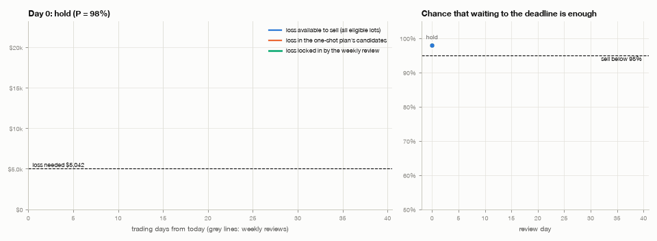
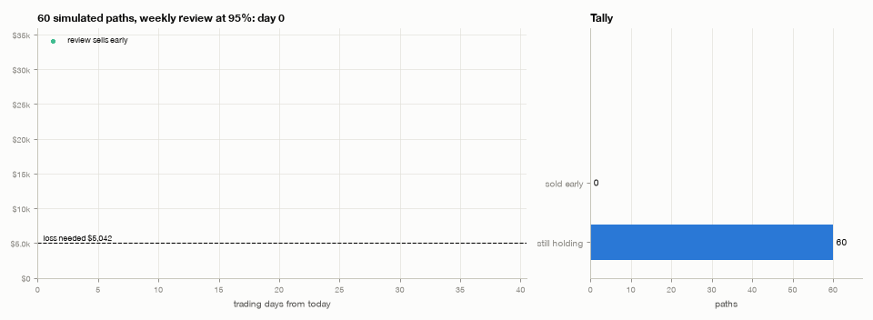

# TaxHarvest

TaxHarvest is a pet project that plans how to meet a **tax-saving goal in dollars** by selling
losing positions. It picks which lots to sell, sells only as much loss as the goal needs,
screens for [US wash sales][us-rules] and [Canadian superficial losses][ca-rules], and suggests
a replacement for each sale so the money stays invested. A **weekly review** then re-checks the
plan with fresh prices and says when to lock the losses in.

I built it from Switzerland, where [private gains on securities are generally untaxed][ch-rules]
and private capital losses are not deductible. For a Swiss private investor, the tax-saving goal
and the harvest plan are both zero.

The portfolios and return assumptions here are illustrative research inputs, not trading or tax
recommendations.

## Where the project stands

| Stage | What it added | Key result |
|---|---|---|
| 1. One-shot plan | Pick the fewest lots whose losses reach a loss target on a future sale date with a chosen confidence, plus the wash-sale screen and four worked examples | Aiming for the *average* loss meets the target only half the time; the calibrated solver hits the chosen confidence |
| 2. Dollar goal, capped sales | The goal is tax dollars, sales stop once it is reached, a sample portfolio and a Swiss control case | Sample portfolio: \$1,200 goal met in 89% of simulated paths, as designed for 90% |
| 3. Weekly review (new) | Re-check with fresh prices; sell early when waiting becomes too risky | Goal met in **99.9%** of paths with 9 reviews, against 95% for the one-shot plan |



*One simulated price path for the sample portfolio. Prices rally, so the losses shrink (blue).
At each weekly review the planner asks how likely it is that waiting to the deadline still
leaves the \$5,042 of loss needed (right). On day 15 that chance falls below 95%, so it sells
and locks the goal in (green). The one-shot plan (orange) waits for its fixed sale date and
ends up with a quarter of the goal.*

The one-shot plan commits to one sale date and hopes enough losses survive until then. The
review removes most of that risk by acting as soon as the odds turn. The main open question is
what waiting is worth at all: in the model, selling today sells the least (see
[below](#weekly-review)).

## Worked example: the sample portfolio

**The question.** A US investor has already realized \$18k of gains this year. They want to
save **\$1,200 of tax** by selling losing positions on **2026-11-25**, 40 trading days from now,
and they want to hit that goal with **90% confidence**. At the assumed 23.8% tax rate, \$1,200
of tax means realizing \$5,042 of losses.

**The answer.** Mark INTC, NKE, and a little DIS as sale candidates. On the sale date, sell them
only until \$5,042 of losses is realized, and buy the listed replacement to stay invested:

| Candidate | Replacement |
|---|---|
| Up to 400 INTC | XLK |
| Up to 180 NKE | XLY |
| Up to 29 DIS | XLC |

The candidates are worth \$24.6k in total. That is more than the goal needs today, because
prices will move before the sale and some losses may recover. In 90% of simulated price paths,
the candidates still hold at least \$5,042 of losses. On average the plan realizes about \$4.9k
of losses and saves about \$1.17k of tax. The average falls a little short of \$1,200 because
the goal is missed in the other 10%.

**The setup.** The [sample portfolio](data/sample_portfolio.csv) is a fictional \$468k book
dated 2026-09-28. It holds 19 taxable lots, a 401(k), and a Roth IRA, with \$23.6k of
unrealized losses in total. Two rule conflicts rule out otherwise good losers:

- **VOO**: the 401(k) has [scheduled IVV purchases](data/sample_portfolio_planned.csv). IVV
  tracks the same index, so selling VOO at a loss would be a wash sale.
- **PFE**: dividends are reinvested automatically (DRIP), which also creates a wash sale.

Asking to erase the whole \$4,284 tax bill on the \$18k of gains is not reachable at 90%
confidence. In that case the planner says so and proposes the largest goal it can meet,
about \$2.14k of tax.

### Reading the plan


**Left: which lots, and how much.** Each row is one lot. The light bar is the loss that lot is
expected to have on the sale date if all of it were sold. Dark blue is the part of that loss
the plan expects to actually realize: only INTC, NKE, and DIS are used. Hatched bars are losses
the rule screen blocks, with the reason in red. Empty rows are lots at a gain or in tax-free
accounts.

**Right: will it be enough?** Each bar counts simulated price paths by how much loss the
candidates hold on the sale date. The black line is the \$5,042 needed. Blue paths reach it
(90%); orange paths fall short (10%). The dashed line is the average, \$8.4k: the plan
deliberately holds a buffer above the goal so that the bad paths still clear it.

### Animations

Each animation shows one step of the reasoning for the same sample plan.

**1. Losses can recover before the sale.**


Left: the candidates' total loss over the 40 days until the sale. Grey lines are individual
simulated paths; the blue bands contain the middle 50% and 90% of paths. The paths start
together and spread out as time passes, and some drift below the dashed "loss needed" line.
Right: where all paths end up on each day. The orange share, the paths that would miss the
goal, grows toward the sale date. This spread is why the plan needs a buffer.

**2. How much buffer to hold depends on the required confidence.**


Each frame re-plans with a stricter confidence requirement: 50%, 70%, 80%, 90%, 95%. Left: how
much of each lot becomes a candidate (grey marks lots the rules allow). Right: the same loss
histogram as in the plan chart. At 50%, a \$13.5k pool of INTC and NKE is enough, and the goal
line sits in the middle of the distribution. Raising the requirement adds lots and pushes the
distribution to the right until only the stated share falls short. The pool grows fastest at
the end: going from 90% to 95% takes it from \$24.6k to \$44k.

**3. The 90% holds on paths the planner has not seen.**


The planner picks candidates using one set of simulated paths, so it could be fitted to that
particular set. This animation tests the finished plan on 100,000 new paths. Left: the share
that meets the goal, recomputed as paths are added (the x-axis is logarithmic). The estimate
jumps around at first and settles close to the 90% target; the shaded band is its 95%
confidence interval. Right: the loss distribution on those new paths.

The 90% only holds if the return model is right. Higher volatility or a strong rally lowers it.
See the [results](docs/RESULTS.md) for those stress tests and [learnings](docs/LEARNINGS.md)
for the design decisions.

## Weekly review

The one-shot plan asks once whether enough losses will be left on the sale date. The review
asks again each week, from that day's prices:

1. **How much loss is still needed?** The goal minus what has already been harvested.
2. **If I wait until the deadline, how likely is it that enough loss remains?** The review
   simulates prices to the deadline, using every lot the rules allow on that date.
3. **Hold or sell.** If that chance is at least the chosen confidence, hold. If it drops below, or it
   is the deadline, sell today until the remaining need is covered. That part is then certain.

The review is meant to run once a week. For the sample portfolio on 2026-09-28:

```text
$ th.py daily data/sample_portfolio.csv --planned data/sample_portfolio_planned.csv \
      --as-of 2026-09-28 --realized-gains 18000 --tax-savings-goal 1200 --deadline 2026-11-25
2026-09-28: 42 trading days to 2026-11-25
  loss goal $5,042  harvested $0 (0%)  still needed $5,042
  eligible loss today $19,130  (cover 3.79x)
  P(enough loss if you wait to the deadline) = 98.1%  (trigger 95%)
  HOLD: waiting is still within your confidence
  keep available (no conflicting buys): VEA taxable, VWO taxable, BND taxable, INTC taxable, ...
  next review: 2026-10-05
```

Three numbers track progress, and each run adds them to `review_log.csv`:

- **progress:** loss harvested ÷ loss goal;
- **cover:** eligible loss today ÷ loss still needed; at 1× or more, today could finish the job;
- **wait confidence:** the chance that waiting to the deadline still leaves enough.

When the review says sell, it writes `orders_<date>.csv` with shares, replacements and the
first safe buy-back date. After a trade, the portfolio CSV and `--harvested-loss` are updated
by hand.



*Sixty simulated paths of the loss available in the sample portfolio. A green dot is a weekly
review that decided to sell early because losses were shrinking; every other path waits and
sells on day 40. The tally on the right fills in as the weeks pass: on these paths the review
meets the goal every time, the one-shot plan in 56 of 60.*

### Does it work?

`th.py backtest` runs each rule on the same 2,000 simulated price paths for the sample's
\$1,200 goal and 40 trading days. The one-shot rows sell on the last day from the plan's
candidates. The daily and weekly rows review every 1 or 5 days. "Sell now" harvests on day 0.


| Rule | Reviews | Goal met | Market value sold |
|---|---|---|---|
| One-shot, 90% | 1 | 89.3% | \$13.5k |
| One-shot, 95% | 1 | 95.4% | \$13.8k |
| Daily, 90% | 41 | 100% | \$17.2k |
| Daily, 95% | 41 | 100% | \$16.5k |
| **Weekly, 90%** | **9** | **99.7%** | \$17.5k |
| **Weekly, 95%** | **9** | **99.9%** | \$16.9k |
| Sell now | 1 | 100% | \$13.1k |

- **Reviewing fixes the one-shot plan's misses.** The one-shot plan misses about as often as
  its confidence allows. A review that can react before losses recover almost never misses.
- **Weekly is nearly as good as daily.** It misses in 0.1–0.3% of paths, with 9 reviews
  instead of 41. Every rule averages one sale day, so the saving is in checking, not trading.
- **95% is the better weekly setting.** It acts earlier (right chart), so it misses less and
  sells less.
- **Waiting costs turnover.** The review rules sell \$3–4k more than selling now, because a
  loss that shrinks needs more shares for the same dollars. In this model, where prices drift
  up slightly, waiting has no payoff. It is worth it only for reasons outside the model: gains
  that are still to come this year, or wanting to harvest more than the goal if prices fall.

## How it works

For each lot, the model simulates prices on a chosen future sale date. The optimization selects
**maximum** fractions of eligible lots. If the requested tax saving is $T$ and the effective
tax rate is $\tau$, the equivalent loss requirement is $K=T/\tau$. The selected lots must have
enough potential loss to reach $K$ in at least the chosen share of scenarios:

```math
\mathbb{P}(\text{potential loss from selected lots} \ge K) \ge \alpha
```

On the sale date, the execution rule sells losing shares only until $K$ is reached. If too few
lots are below basis, it sells what is available and records the shortfall in
`orders.attrs["shortfall"]`. Gains from **actual or explicitly planned realizations** set the
modeled tax bill. Unsold holdings' price changes
inform future loss capacity but do not count as taxable gains.

The optimizer minimizes the size of the candidate pool with a penalty for replacements that
track the originals poorly. `calibrated` is the default solver; `mean`, `cvar`, and `milp` are
comparison methods. If the requested tax saving cannot be reached at the required confidence,
the planner reports the reliable upper bound and uses 98% of it as the fallback goal. That leaves
some room for finite-scenario error while still pursuing available savings.

The rule screen checks taxable status, recent and planned purchases of the same security or
index group, purchases in other accounts, and DRIPs. Its fund grouping is conservative and
editable. The screen only knows about the accounts and purchases in its input, so spouse and
retirement accounts and scheduled contributions have to be listed there. See [`washsale.py`](src/taxharvest/washsale.py).

The default [factor parameters](src/taxharvest/assets.csv) are illustrative. Pass
`--history prices.csv` to fit a persistent market-regime model to daily prices; Student-t and
bootstrap models are available for stress tests.

The review's wait confidence is the same chance constraint, computed from the current day with
the remaining need $K - H$ (where $H$ is the loss already harvested) and every lot eligible on
the deadline. It assumes nothing is sold before the deadline, so it errs on the safe side: a real
review can still act next week. The backtest nests one simulation inside another: 1,000 fresh
scenarios at each review on each of 2,000 paths.

## Code and reproduction

The engine is in [`src/taxharvest/`](src/taxharvest/) and the inputs in [`data/`](data/). With
Python 3.12+ and [uv](https://docs.astral.sh/uv/), `uv run --group dev pytest` runs the tests and
`uv run python scripts/run_sample.py` regenerates the sample figures in [`figures/`](figures/).
`scripts/th.py` has commands for the one-shot plan (`run`), the review (`daily`), the rule
comparison (`backtest`, with `--animate` for the two review GIFs), and the worked examples
(`examples`). They read a portfolio CSV
(`account,ticker,shares,cost_basis,acquired,price[,drip]`) and optional planned purchases
(`ticker,on,account`).

## Limits

- Tax is represented by one effective rate. The model does not implement US short-term/long-term
  netting, all Canadian tax edge cases, or the value of capital-loss carryforwards.
- The review counts weekdays as trading days and ignores market holidays. It does not track
  new gains itself: the year's realized gains are an input to each review.
- Every result, including the backtest, assumes the return model is right. The
  [results](docs/RESULTS.md) stress-test the one-shot plan against other models; the review
  rules have not been stress-tested that way yet.
- Replacement similarity is a modeling judgment. The execution method assumes fractional shares
  and rounds down to six decimal places; broker restrictions can leave a small shortfall.

[us-rules]: https://www.irs.gov/publications/p550
[ca-rules]: https://www.canada.ca/en/revenue-agency/services/tax/individuals/topics/about-your-tax-return/tax-return/completing-a-tax-return/personal-income/line-12700-capital-gains/capital-losses-deductions.html/1000
[ch-rules]: https://www.estv.admin.ch/dam/estv/en/dokumente/estv/steuersystem/schweizer-steuersystem/ch-steuersystem.pdf.download.pdf/ch-steuersystem.pdf
