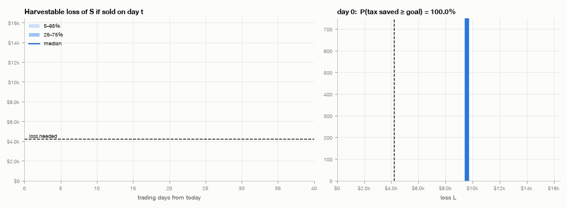
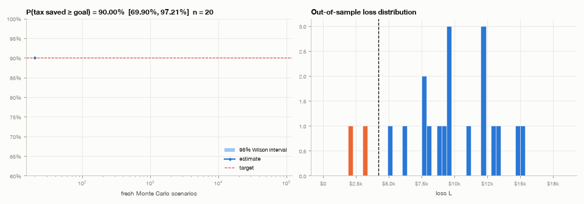
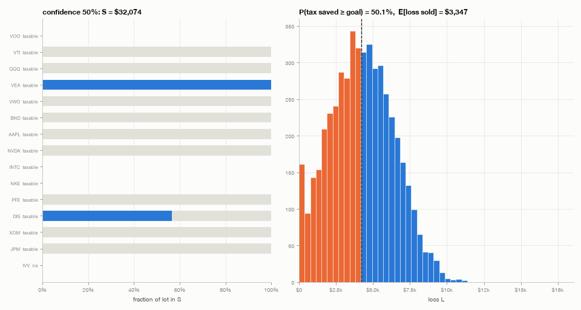

# TaxHarvest

TaxHarvest plans sales to meet a **tax-saving goal in dollars**. It selects eligible tax lots
that can reach that goal with a chosen confidence, then caps the actual sale at the loss needed
for the goal. The final lot can be sold partly. The plan also screens for [US wash sales][us-rules]
and [Canadian superficial losses][ca-rules] and suggests replacement holdings.

I built it from Switzerland, where [private gains on securities are generally untaxed][ch-rules]
and private capital losses are not deductible. For a Swiss private investor, the tax-saving goal
and the harvest plan are both zero.

The portfolios and return assumptions here are illustrative research inputs, not trading or tax
recommendations.

## Try it

From `TaxHarvest/`, use Python 3.12 or later and [uv](https://docs.astral.sh/uv/):

```bash
uv sync
uv run --group dev pytest
uv run python scripts/run_sample.py --quick
uv run python scripts/th.py examples --only canada --quick
```

To plan for a dollar amount of tax savings from your own portfolio:

```bash
uv run python scripts/th.py run data/us_portfolio.csv \
    --planned data/us_portfolio_planned.csv \
    --as-of 2026-09-24 --jurisdiction US \
    --realized-gains 15000 --tax-savings-goal 1000 \
    --confidence 0.9 --horizon-days 40
```

The portfolio CSV needs `account,ticker,shares,cost_basis,acquired,price`; `drip` is optional.
Planned purchases use `ticker,on,account`. You can also enter lots with
`uv run python scripts/th.py interactive`. If you omit `--tax-savings-goal`, the requested goal
is the full modeled tax bill on the gains you supplied. When that goal cannot be met at the
chosen confidence, the report shows the attainable amount and builds a smaller fallback goal.

The CLI writes maximum candidate sales to `trades.csv`, a `summary.json`, charts, and GIFs to
`out/` by default. The worked examples and sample go to `figures/`. The CSV is **not a set of
fixed orders**: on the sale date, `HarvestPlan.execute(prices)` uses actual prices, ranks the
selected lots by loss per replacement-adjusted trading cost, and stops once the tax-saving goal
is reached. The last sale may be partial.

## The sample portfolio

The [sample portfolio](data/sample_portfolio.csv) is a fictional \$468k book dated 2026-09-28.
It has 19 taxable lots, a 401(k), a Roth IRA, \$23.6k of unrealized losses, and \$18k of gains
already realized. [Planned 401(k) purchases](data/sample_portfolio_planned.csv) and a dividend
reinvestment plan (DRIP) can block otherwise attractive sales.

The worked US plan asks to save **\$1,200 of tax** at **90% confidence**. At the assumed 23.8%
rate, that needs \$5,042 of realized losses. The engine selects a \$24.6k candidate pool, but
expects to realize only about \$4.9k of losses and save about \$1.17k of tax because some
scenarios miss the goal. It never realizes more than \$5,042 of losses for this goal.

| Maximum candidate sale | Replacement |
|---|---|
| Up to 400 INTC | XLK |
| Up to 180 NKE | XLY |
| Up to 29 DIS | XLC |

The selected lots are ranked again at the sale date; those maxima are not all sold together.
VOO is blocked by scheduled IVV purchases in the 401(k), and PFE by its DRIP. A request to erase
the full modeled \$4,284 tax bill is infeasible at 90% confidence. The planner reports that
limit and offers an attainable tax-saving goal of about \$2.14k instead.


The sample plan reaches about 90% confidence on fresh simulations, but its coverage is lower
when volatility or rally assumptions change. See the [results](docs/RESULTS.md) for the
stress tests and [learnings](docs/LEARNINGS.md) for the design decisions.

## Animated views

| Loss capacity as the sale date approaches | Confidence estimate converging | Candidate pool as confidence rises |
|---|---|---|
|  |  |  |

## How it works

For each lot, the model simulates prices on a chosen future sale date. The optimization selects
**maximum** fractions of eligible lots. If the requested tax saving is $T$ and the effective
tax rate is $\tau$, the equivalent loss requirement is $K=T/\tau$. The selected lots must have
enough potential loss to reach $K$ in at least the chosen share of scenarios:

```math
\mathbb{P}(\text{potential loss from selected lots} \ge K) \ge \alpha
```

On the sale date, the execution rule sells losing shares only until $K$ is reached. If too few
lots are below basis, it sells what is available and records the shortfall in
`orders.attrs["shortfall"]`. Gains from **actual or explicitly planned realizations** set the
modeled tax bill. Unsold holdings' price changes
inform future loss capacity but do not count as taxable gains.

The optimizer minimizes the size of the candidate pool with a penalty for replacements that
track the originals poorly. `calibrated` is the default solver; `mean`, `cvar`, and `milp` are
comparison methods. If the requested tax saving cannot be reached at the required confidence,
the planner reports the reliable upper bound and uses 98% of it as the fallback goal. That leaves
some room for finite-scenario error while still pursuing available savings.

The rule screen checks taxable status, recent and planned purchases of the same security or
index group, purchases in other accounts, and DRIPs. Its fund grouping is conservative and
editable. The screen only knows about accounts and purchases you supply; include relevant
spouse and retirement accounts and scheduled contributions. See [`washsale.py`](src/taxharvest/washsale.py).

The default [factor parameters](src/taxharvest/assets.csv) are illustrative. Pass
`--history prices.csv` to fit a persistent market-regime model to daily prices; Student-t and
bootstrap models are available for stress tests.

## Limits

- Tax is represented by one effective rate. The model does not implement US short-term/long-term
  netting, all Canadian tax edge cases, or the value of capital-loss carryforwards.
- The plan uses one future sale date. It does not re-plan as prices and account activity change.
- Replacement similarity is a modeling judgment. The execution method assumes fractional shares
  and rounds down to six decimal places; broker restrictions can leave a small shortfall.

Source code is in [`src/taxharvest/`](src/taxharvest/), inputs in [`data/`](data/), and generated
figures in [`figures/`](figures/).

[us-rules]: https://www.irs.gov/publications/p550
[ca-rules]: https://www.canada.ca/en/revenue-agency/services/tax/individuals/topics/about-your-tax-return/tax-return/completing-a-tax-return/personal-income/line-12700-capital-gains/capital-losses-deductions.html/1000
[ch-rules]: https://www.estv.admin.ch/dam/estv/en/dokumente/estv/steuersystem/schweizer-steuersystem/ch-steuersystem.pdf.download.pdf/ch-steuersystem.pdf
