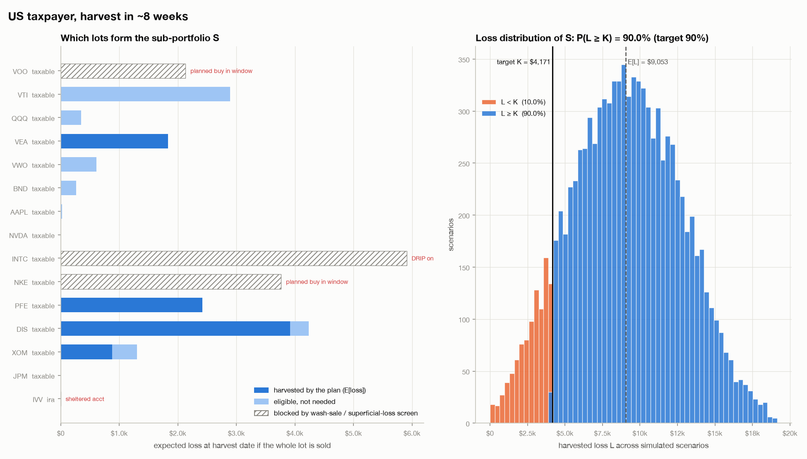
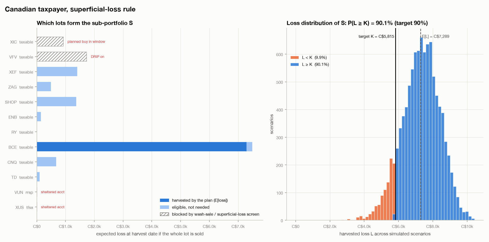
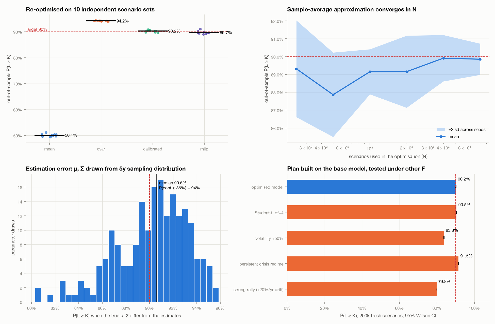
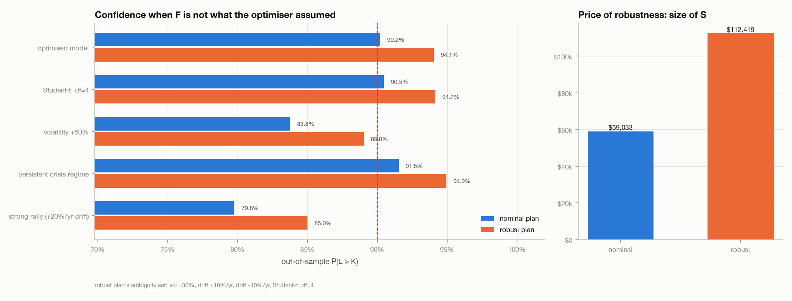
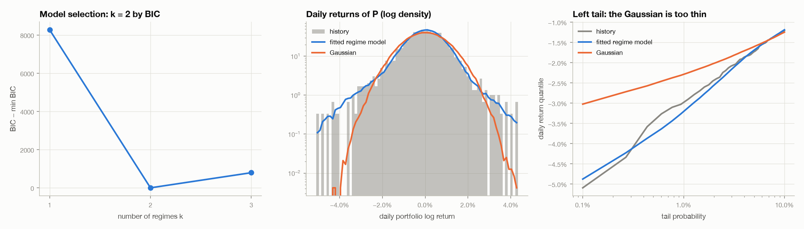
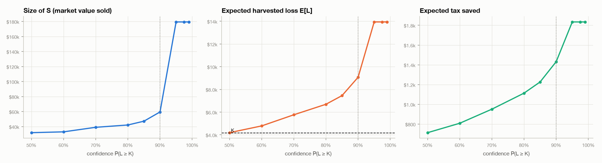

# Results

Four worked examples, all generated by `uv run python scripts/th.py examples`
(seed-fixed, about 45 minutes on a laptop). Portfolios, prices and factor parameters are
illustrative. What matters is how the method behaves, not the dollar amounts.

**Headline.** The calibrated chance-constrained plan reaches the required confidence out of
sample: **90.2%, 90.2%, 90.0% and 95.1%** against targets of 90/90/90/95%, averaged over 10
independent re-optimisations. The obvious "make expected losses equal the target" plan
reaches only **46–52%**. Among the convex methods, calibrated gives the smallest harvest.
Its weak point is model risk. If volatility is 50% higher than assumed, or markets rally
hard, confidence falls to 79–86%. A distributionally robust version recovers 5–9 points of
that, at the cost of a 15–90% larger sub-portfolio.

## 1. The four examples

| Example | Jurisdiction | Horizon | Target $K$ | $\alpha$ | $\mathbb{P}(L \ge K)$ in-sample | $\mathbb{E}[L]$ | Size of $S$ | $S / P$ | Blocked losers |
|---|---|---|---|---|---|---|---|---|---|
| `us_core` | US | 40 d | \$4,171 = $0.238 \times \mathbb{E}[G]$ | 90% | 90.0% | \$9,053 | \$59,033 | 20.1% | VOO (IRA contribution buys IVV), NKE (spouse buy), INTC (DRIP) |
| `canada` | CA | 40 d | C\$5,815 = $0.268 \times \mathbb{E}[G]$ | 90% | 90.1% | C\$7,289 | C\$12,846 | 5.9% | XIC (spouse buys ZCN, same index), VFV (TFSA DRIP on XUS, same index) |
| `learned_regime` | US | 40 d | \$3,456 | 90% | 90.1% | \$7,078 | \$43,612 | 14.9% | as `us_core` |
| `year_end` | US | 5 d | \$9,141 = $\mathbb{E}[G]$ (full offset) | 95% | 95.0% | \$11,097 | \$50,718 | 40.8% | old VTI lot (new VTI lot bought 16 days before the sale) |

$\mathbb{E}[L]$ is well above $K$. With a 40-day horizon the loss distribution is wide: in the US example
the 5th–95th percentile range is \$3.0k–\$15.1k. Getting the *10% worst case* up to $K$ pushes
the mean to about $2.2\,K$. Over 5 days (`year_end`) the losses are nearly known, and $\mathbb{E}[L]$ is
only $1.2\,K$.

**US trades** (`figures/us_core/trades.csv`): conditional sells of VEA → IEFA ($\rho = 1.00$),
PFE → XLV ($\rho = 0.58$), DIS → XLC ($\rho = 0.68$), and 68 of 100 XOM → XLE ($\rho = 0.82$). Each comes with
a do-not-rebuy date of 2026-12-22 that applies across **every** account. The three blocked
lots hold \$12,120 of unrealised losses, more than the whole plan harvests in expectation.

## 2. Method comparison (out of sample)

Each method was re-optimised on 10 independent sets of 5,000 scenarios, and each plan was
then scored on 100,000 fresh scenarios.

| Example | target | `mean` | `cvar` | **`calibrated`** | `milp` |
|---|---|---|---|---|---|
| us_core | 90% | 50.1% | 94.2% | **90.2%** | 89.7% |
| canada | 90% | 51.9% | 96.1% | **90.2%** | 90.0% |
| learned_regime | 90% | 45.6% | 95.8% | **90.0%** | 90.1% |
| year_end | 95% | 50.7% | 95.7% | **95.1%** | 94.8% |

Sd across seeds is 0.3–0.9 points. For the same 90% target in the Canada case, `cvar` sells
C\$23.8k and `calibrated` sells C\$12.8k. In the US case, `cvar` at 90% is **infeasible** and
falls back to selling everything (\$179k), even though the chance constraint is satisfiable
with \$59k.

## 3. Stochastic robustness (Monte Carlo)

**Convergence in the number of scenarios.** The calibrated plan's out-of-sample confidence
is within about 1 point of target from $N = 1000$ onwards in every example. At $N = 8000$ the
seed-to-seed sd is 0.2–0.5 points. There are only ~15 decision variables, so the
sample-average approximation hardly overfits.

**Estimation error.** $\mu$ and $\Sigma$ were redrawn 200 times from their sampling distribution given
5 years of daily data, keeping the plan fixed:

| Example | median $\mathbb{P}(L \ge K)$ | 5th percentile |
|---|---|---|
| us_core | 90.6% | 84.3% |
| canada | 89.9% | 84.5% |
| learned_regime | 89.2% | 83.3% |
| year_end | 95.1% | 93.9% |

With 40-day horizons, drift uncertainty costs up to 6–7 points in a bad draw. Over 5 days it
barely matters.

**Wrong model family.** The same plan was scored under distributions it was not optimised
for (200k scenarios each; 95% Wilson intervals are $\pm$0.1–0.2 points):

| Evaluated under | us_core | canada | learned_regime | year_end |
|---|---|---|---|---|
| model it was optimised on | 90.2 | 90.2 | 90.2 | 95.1 |
| Student-t, $\nu = 4$ (same mean/cov) | 90.5 | 90.6 | 89.8 | 95.5 |
| persistent crisis regime | 91.5 | 91.7 | 90.9 | 96.0 |
| volatility +50% | **83.8** | **80.6** | **82.4** | **86.4** |
| strong rally (+20%/yr drift) | **79.8** | **82.3** | **78.8** | 93.1 |
| true data-generating $F$ (learned example only) | – | – | 89.2 | – |

Fat tails and crashes don't hurt, because a harvest *wants* bad scenarios. What hurts is
anything that lets losing lots recover before the harvest date: more upside dispersion, or a
rally.

**Distributionally robust plan.** This plan has to hold under an ambiguity set of vol +30%,
drift $\pm$10%/yr and Student-t ($\nu = 4$). The set is deliberately milder than the stresses above, so the
test isn't circular.

| Example | nominal: vol +50% / rally | robust: vol +50% / rally | size of S nominal → robust |
|---|---|---|---|
| us_core | 83.8 / 79.8 | 89.0 / 85.0 | \$59k → \$112k |
| canada | 80.6 / 82.3 | 86.8 / 87.9 | C\$12.8k → C\$20.3k |
| learned_regime | 82.4 / 78.8 | 89.0 / 87.4 | \$43.6k → \$60.1k |
| year_end | 86.4 / 93.1 | 87.8 / 94.3 | \$50.7k → \$58.3k (infeasible: every eligible lot reaches only 91.1% worst-case) |

## 4. The learned return model

`learned_regime` generates 2,500 days of synthetic history from a known two-regime process
(calm/crisis, $p_{\text{stay}} = 0.985 / 0.93$, crisis vol $\times 2.3$) and learns $F_P$ from that
history alone. BIC picks $k = 2$. Baum–Welch recovers the persistence as $0.985 / 0.939$ and
the vol ratio as $2.31$ (true value $2.31$). The fitted model reproduces the historical left tail,
where a Gaussian with the same covariance puts the 0.1% daily quantile at −3.0% instead of
about −5%. The plan built on the learned model scores 89.2% under the true process (target
90%).

## 5. Price of confidence

In the US book $S$ grows slowly up to 90% (\$32k at 50%, \$59k at 90%). Past 90% the chance
constraint can't be met, and the plan falls back to harvesting everything (\$179k, 94%
reachable). In Canada, $S$ grows from C\$10k at 50% to C\$51k at 99%. Each extra point of
confidence gets more expensive, because it has to be bought with lots whose loss is less and
less certain.

## Animations

Per example: `loss_fan.gif` (the harvestable loss of S as the harvest date approaches),
`mc_convergence.gif` (the Monte Carlo estimate of $\mathbb{P}(L \ge K)$ with a Wilson band) and
`frontier_sweep.gif` (how $S$ changes as $\alpha$ rises).
