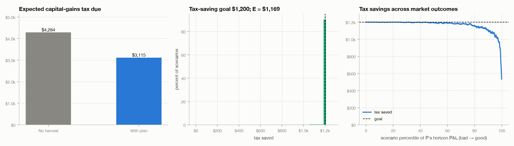
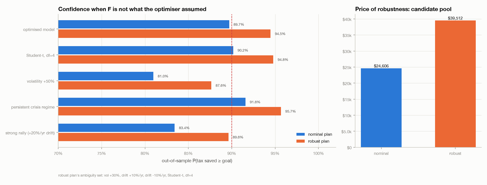

# Results

These are illustrative, seed-fixed runs from `uv run python scripts/run_sample.py --quick`
and `uv run python scripts/th.py examples --quick`. The goal throughout is **tax saved**, not
losses realized. The model chooses a pool of *possible* sales; on the sale date it sells only
enough losing shares to meet the goal. Dollar amounts and return assumptions are examples,
not forecasts.

## What changed in the sample

The US sample has $18,000 of realized gains and asks to save **$1,200 of tax** at 90%
confidence. At the assumed 23.8% rate, it needs at most $5,042 of realized losses. The plan
selects a $24,606 candidate pool, yet expects to sell about $13,234 of holdings at current
prices, realize $4,913 of losses, and save $1,169 of tax. Expected unused loss capacity is
$3,475. Its in-sample chance of reaching the full $1,200 is 90.1%.

Asking to erase the entire modeled $4,284 tax bill is infeasible at 90% confidence. The
estimated reliable maximum is $2,182; the planner offers a $2,138 goal, slightly below that
bound, and still caps the actual sale at the corresponding loss amount.

## Four other books

All values below are in the book's currency. "Pool" is the market value of maximum candidate
sales; "sold" is expected market value sold at today's prices. Losses and tax savings are
expected *after* the execution cap.

| Book | Tax-saving goal | Required confidence | In-sample confidence | Expected loss realized | Expected tax saved | Expected sold | Pool |
|---|---:|---:|---:|---:|---:|---:|---:|
| US core | $1,000 | 90% | 90.0% | $4,064 | $967 | $23,615 | $59,299 |
| Canada | C$1,500 | 90% | 90.1% | C$5,549 | C$1,485 | C$9,983 | C$12,381 |
| Learned regime | $825 | 90% | 90.1% | $3,359 | $799 | $20,410 | $43,742 |
| Year end | $2,142 | 95% | 95.0% | $8,976 | $2,136 | $34,517 | $48,309 |

Expected tax saved is a little below the goal because some scenarios miss it. The year-end
goal is the full modeled tax bill on $9,000 of realized gains; the other three goals are
explicit dollar requests. The US and Canadian rule screens exclude lots affected by planned
purchases or dividend reinvestment. [US plan](../figures/us_core/plan.png) ·
[Canada plan](../figures/canada/plan.png) ·
[Learned-model fit](../figures/learned_regime/learned_fit.png) ·
[Year-end plan](../figures/year_end/plan.png)

## Does the confidence survive new simulations?

In the quick run, each method is re-optimized on four independent sets of 5,000 scenarios and
scored on 100,000 fresh scenarios. The numbers are mean out-of-sample chances of meeting the
tax-saving goal. `mean` sizes the pool to match expected loss; `cvar` is a conservative
constraint; `calibrated` is the default.

| Book | Required | `mean` | `cvar` | `calibrated` |
|---|---:|---:|---:|---:|
| US core | 90% | 50.3% | 90.1% | 90.4% |
| Canada | 90% | 51.8% | 96.3% | 90.3% |
| Learned regime | 90% | 45.6% | 95.7% | 89.9% |
| Year end | 95% | 50.4% | 94.9% | 95.1% |

Four seeds give a useful check, not a guarantee. With 60 draws of estimated return parameters
from five years of data, the 5th-percentile confidence of the fixed calibrated plans is 85.5%,
84.7%, 85.1%, and 93.7% in the table's order. New scenarios reduce simulation noise; they
do not remove model uncertainty.

## What if the return model is wrong?

The sample plan, evaluated on 50,000 new scenarios per stress, reaches its $1,200 goal 89.7%
of the time under its assumed model. That falls to 81.0% with 50% more volatility and 83.4%
with a strong rally. A robust plan built for a milder ambiguity set lifts those two figures
to 87.6% and 89.6%, respectively. Its candidate pool grows from $24,606 to $39,512, while
its expected actual sale remains much smaller than either pool.

The year-end book exposes a comparison limit: its full $2,142 goal is feasible under the
nominal model, but the robust ambiguity set supports only about $2,060 at 95% confidence.
The robust plan therefore targets $2,019. Its confidence cannot be compared directly with
the nominal plan's confidence, so no robust-versus-nominal chart is published for that book.

The [sample outputs](../figures/sample/) and each book's `summary.json` contain the full
frontier and stress results. The [three GIFs in the README](../README.md#animated-views) show
how loss capacity and the candidate pool evolve. See [Learnings](LEARNINGS.md) for the design
choices and limits.
