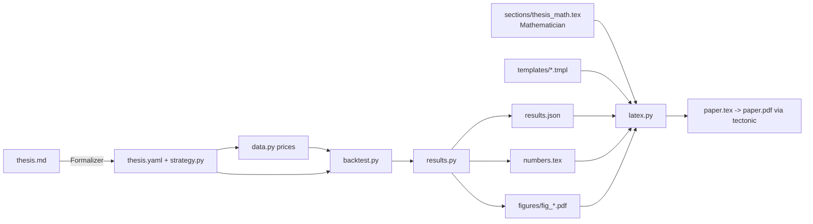

# AGENTS.md: map of the repo for AI agents

Repo `harness` = two independent parts.
1. `src/tradebot/`: generic, thesis-free trading infra (IBKR paper/live broker, sim broker, sizing, risk, backtest).
2. `src/thesispaper/`: turns ANY investment thesis (`theses/<slug>/thesis.md`) into a mathematical LaTeX paper + PDF.
They share no code. Never import one from the other.

## thesispaper modules (`src/thesispaper/`, each < 200 lines, docstring = PURPOSE / INPUTS / OUTPUTS)

| Module | Purpose | Input -> Output |
|---|---|---|
| `spec.py` | Load/validate `thesis.yaml` | slug -> `Thesis` dataclass (`SpecError` lists all problems) |
| `data.py` | Adjusted-close prices (yfinance, csv, synthetic), cached in `theses/<slug>/data/` | `Thesis` -> DataFrame[date x ticker] |
| `metrics.py` | Returns, wealth, CAGR, vol, Sharpe, drawdown, Gaussian MLE + se, Kelly approx, stationary bootstrap | Series -> floats / intervals |
| `strategy.py` | `Strategy` protocol; loader for `theses/<slug>/strategy.py`; built-ins `buy_hold`, `constant_mix` | `Thesis` -> Strategy |
| `backtest.py` | Apply target weights to next-period returns, costs on turnover, benchmark | prices + Strategy -> `BacktestResult` |
| `results.py` | Full pipeline; the single source of every cited number | spec -> `results.json`, `numbers.tex` |
| `figures.py` | Generic figures | results -> `figures/fig_*.pdf` (+png) |
| `latex.py` | Assemble `paper.tex` from `templates/`, compile with `tectonic` | spec + templates -> `paper.tex`, `paper.pdf` |
| `cli.py` | `thesispaper` entry point | argv -> exit code |

Other top-level pieces: `templates/` (LaTeX), `theses/<slug>/` (one folder per thesis), `.claude/commands/thesis-to-paper.md`
(orchestration prompt), `tests/` (offline only; network tests need `THESIS_ONLINE=1`).

### tradebot modules (generic infra, see ARCHITECTURE.md)
`strategy/` (base, constant), `execution/` (runner loop, sizer weights -> whole shares), `broker/` (base protocol, sim, ibkr),
`risk.py` (kill switch, notional cap), `state/` (SQLAlchemy persistence, reconcile), `backtest.py`, `instruments.py`,
`portfolio.py`, `data/sources/`, `config.py`, `notify.py`.

## Data flow



## CLI (stable; docs and code must agree)
```
uv run thesispaper new <slug>     scaffold theses/<slug>/{thesis.md,thesis.yaml,strategy.py}
uv run thesispaper check <slug>   validate spec + strategy import + no-lookahead smoke test
uv run thesispaper run <slug>     data -> backtest -> results.json + numbers.tex + figures/
uv run thesispaper build <slug>   assemble + compile -> paper.tex, paper.pdf
uv run thesispaper all <slug>     check, run, build
```
Agent entry point: `/thesis-to-paper <slug>` in Claude Code (Formalizer, Mathematician, Runner, Reviewer; max 2 review loops).

## thesis.yaml keys
`title, author, slug` (= folder name), `summary` (abstract), `universe: [tickers]`, `benchmark: ticker`, `start`, `end|null`,
`base_currency`, `costs_bps` (per unit turnover), `rebalance` (daily|weekly|monthly), `strategy: {module: "strategy.py" | "builtin:constant_mix" | "builtin:buy_hold", params}`,
`hypotheses: [{id, statement}]`, `sections` (names of optional templates), `extra_sections` (files in the thesis folder, spliced in as paper section 6), optional `data_source` (yfinance|csv|synthetic), `csv_files`, `seed`.

## Paper structure (templates/sections/*.tex.tmpl, sorted by prefix)
01 design (+ hypotheses), 02 accounting (FX, NAV, weights), 03 performance, 04 estimation (MLE, se, stationary bootstrap),
05 sizing (Kelly approx, fractional Kelly), 06 thesis math (agent-written, spliced from `sections/thesis_math.tex` / `extra_sections`),
07 results (table + figures), 08 limitations (auto caveats), 09 conclusion.
`templates/preamble.tex` is inlined as `$preamble`; `paper.tex.tmpl` wraps `$body`.

## Conventions
- Python 3.12, uv, ruff clean, type hints, small pure modules, docstring at top of every file (PURPOSE / INPUTS / OUTPUTS).
- Tests offline with synthetic prices. No network in tests unless `THESIS_ONLINE=1`.
- Templates are filled with `string.Template.safe_substitute`. In `*.tmpl` files any `$word` is a placeholder:
  write math with `\( \)`, `\[ \]`, `equation`, never bare `$`. Available placeholders: `title author slug abstract hypotheses currency extra_sections thesis_math preamble body`.
- Every number in the paper prose comes from `\input{numbers.tex}` macros (generated from `results.json`): `\CAGR \Vol \Sharpe \MaxDD \TotalReturn
  \BenchCAGR \BenchVol \BenchSharpe \BenchMaxDD \NObs \StartDate \EndDate \CostBps \SharpeCILow \SharpeCIHigh` and more (see `results.py`). Use `\CAGR{}`.
- Equations are `equation` environments with labels `eq:<area>-<name>`; thesis math uses `eq:tm-*`, `sec:thesis-math`.
- Strategy contract: `build(params: dict) -> Strategy`; `weights(history)` gets prices up to the decision date only, returns non-negative weights with sum <= 1.
  Weights decided at date t earn returns from t+1. Do not use `from __future__ import annotations` with `@dataclass` in a thesis `strategy.py`
  (the file is loaded by path, not registered in `sys.modules`).
- Generated files (`data/`, `results.json`, `numbers.tex`, `figures/`, LaTeX aux) are git-ignored; `paper.tex` and `paper.pdf` are trackable.

## How to add
- Strategy: `thesispaper new <slug>`, edit `strategy.py`, run `check`. Or use `builtin:constant_mix` in yaml.
- Paper section: for a generic chapter add `templates/sections/NN_name.tex.tmpl` (NN digits = always included) or a non-numeric name and list it in `sections`.
  For one thesis write `theses/<slug>/sections/name.tex` and list it in `extra_sections`.
- Figure: add a function in `figures.py` writing `figures/fig_<name>.pdf`, then reference it in a template with `\includegraphics{figures/fig_<name>.pdf}`.
- Number: add it to `results.json` and the macro map in `results.py`; then use `\Macro{}` in templates.

## Rules
- Stay inside your ownership area; keep modules small. Do not commit unless the user asks.
- The paper must never present results as investment advice or evidence of future returns; the disclaimer is generated and must stay.
- Report honestly when a hypothesis is not supported.

## Do NOT
- Do not hand-type any empirical number into templates or `thesis_math.tex`.
- Do not use future data in a strategy (no `shift(-k)`, no full-sample statistics, no reading the end of `history`'s future).
- Do not put bare `$` in `*.tmpl` files.
- Do not put thesis-specific code in `tradebot`, or import `tradebot` from `thesispaper`.
- Do not commit `.env`, IBKR credentials, licensed data, or run live trading. The trading infra is paper mode only; see SECURITY.md.
