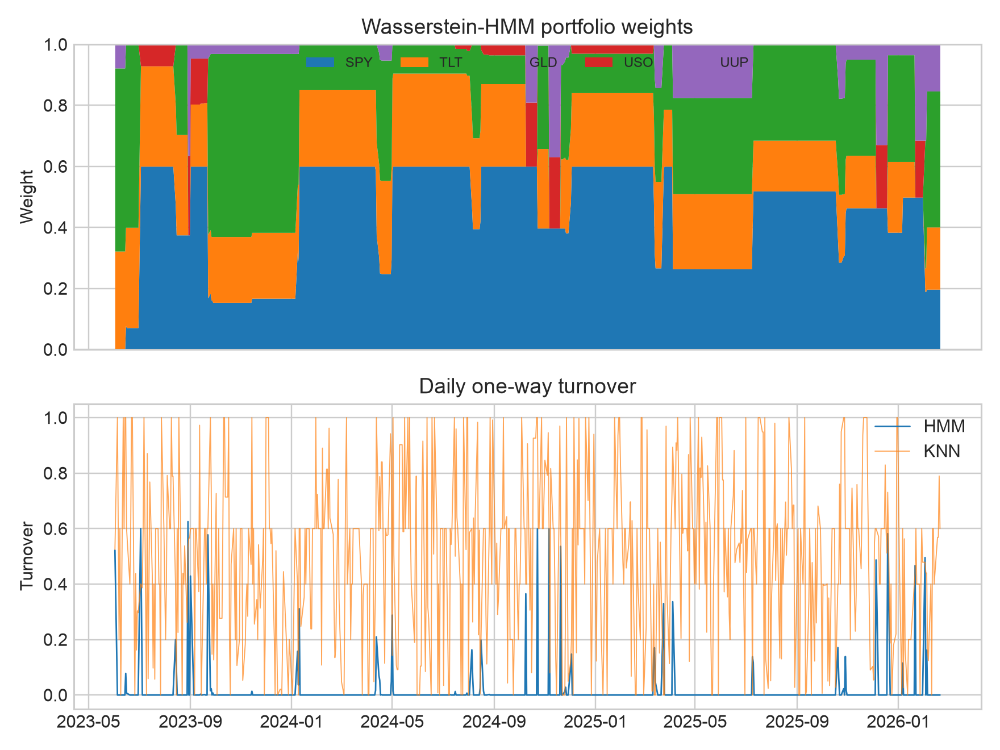

# Reproducing *Explainable Regime-Aware Investing*

A clean-room implementation and reproducibility audit of:

> Amine Boukardagha, [*Explainable Regime Aware Investing*](https://arxiv.org/abs/2603.04441), arXiv:2603.04441v1 (2026).

This project reconstructs the paper's causal Wasserstein hidden Markov model (HMM), persistent regime templates, conditional return estimation, and transaction-penalized portfolio optimizer. It also implements the paper's K-nearest-neighbor (KNN) comparator and passive benchmarks.

## Bottom line

The **architecture is reproducible**, but the paper's **headline performance is not independently reproducible from the published specification**.

- The reproduced HMM is much more stable than KNN: average one-way turnover is **0.0166 versus 0.4949**.
- The reproduced HMM Sharpe is **1.59**, not the published **2.18**.
- Equal weight reaches a reproduced Sharpe of **1.68** with a smaller drawdown than the HMM.
- After explicit 5-bp trading costs, HMM Sharpe is **1.57** and KNN Sharpe falls to **0.38**.

The robust finding is therefore **lower turnover and greater implementation stability**, not verified dominance over passive diversification.


## Published versus reproduced results

The out-of-sample interval is 2023-06-02 through 2026-02-20, containing 682 sessions.

| Strategy | Published Sharpe | Reproduced Sharpe | Published max drawdown | Reproduced max drawdown | Reproduced total return |
|---|---:|---:|---:|---:|---:|
| Wasserstein HMM | 2.18 | **1.59** | -5.43% | **-9.35%** | 53.17% |
| KNN | 1.81 | **0.79** | -12.52% | **-13.20%** | 33.66% |
| Equal weight | 1.59 | **1.68** | -9.87% | **-7.96%** | 47.98% |
| SPX / SPY | 1.18 | **1.36** | -14.62% | **-18.76%** | 69.38% |

Primary results are gross because the target paper penalizes turnover inside the optimizer but does not clearly state whether its performance tables deduct realized costs.

| Strategy | Gross Sharpe | Net Sharpe at 5 bps | Gross return | Net return at 5 bps | Average turnover |
|---|---:|---:|---:|---:|---:|
| Wasserstein HMM | 1.59 | **1.57** | 53.17% | **52.31%** | 0.0166 |
| KNN | 0.79 | **0.38** | 33.66% | **12.91%** | 0.4949 |


## Model summary

### 1. Strictly causal features

For adjusted prices $P_t$, log returns are

$$
r_t = \log P_t - \log P_{t-1}.
$$

The decision for session $t$ uses only information available through $t-1$:

$$
x_t =
\begin{bmatrix}
r_{t-1} \\
\sigma^{(60)}_{t-1} \\
m^{(20)}_{t-1}
\end{bmatrix}
\in \mathbb{R}^{3N},
$$

where $\sigma^{(60)}$ is rolling volatility and $m^{(20)}$ is rolling mean return. This resolves a timing ambiguity in the source paper, which writes $r_t$ inside $x_t$ while also claiming that all inputs stop at $t-1$.

### 2. Predictive Gaussian HMM

Conditional on latent state $z_t=k$,

$$
x_t \mid z_t=k \sim \mathcal{N}(a_k,B_k),
\qquad
\Pr(z_t=j\mid z_{t-1}=i)=A_{ij}.
$$

The state count is chosen from $K\in\{2,3,4,5,6\}$ using a penalized validation likelihood:

$$
S_t(K)
=
\frac{1}{|V_t|}\log p(X_{V_t}\mid X_{H_t\setminus V_t},K)
-\lambda_K q(K).
$$

The model is refitted every 10 sessions and its order is reconsidered every 63 sessions.

### 3. Wasserstein template tracking

Repeated HMM estimation can permute state labels. Each fitted Gaussian component is therefore assigned to the nearest persistent template using

$$
W_2^2\!\left(\mathcal{N}(a_1,B_1),\mathcal{N}(a_2,B_2)\right)
=
\|a_1-a_2\|_2^2
+
\operatorname{tr}\!\left[
B_1+B_2-2\left(B_2^{1/2}B_1B_2^{1/2}\right)^{1/2}
\right].
$$

The reproduction maintains six templates and updates their feature and return moments by exponential smoothing.

### 4. Template-conditioned asset moments

The paper does not specify how its $3N$-dimensional feature distributions become $N$-dimensional portfolio moments. This implementation makes that bridge explicit. With filtered posterior weight $\xi_{s,k}$,

$$
\widehat{\mu}_k
=
\frac{\sum_{s<t}\xi_{s,k}R_s}{\sum_{s<t}\xi_{s,k}},
$$

and $\widehat{\Sigma}_k$ is a posterior-weighted covariance shrunk toward its diagonal. Template probabilities then produce

$$
\widehat{\mu}_t=\sum_{g=1}^{G}p_{t,g}\widehat{\mu}_g,
\qquad
\widehat{\Sigma}_t=\sum_{g=1}^{G}p_{t,g}\widehat{\Sigma}_g.
$$

### 5. Transaction-aware allocation

Daily weights solve

$$
\begin{aligned}
\max_{w_t}\quad
&\widehat{\mu}_t^\top w_t
-\gamma w_t^\top\widehat{\Sigma}_t w_t
-\tau\|w_t-w_{t-1}\|_1 \\
\text{s.t.}\quad
&\mathbf{1}^\top w_t=1,
\qquad 0\leq w_{t,i}\leq w_{\max}.
\end{aligned}
$$

The clean-room specification uses $\gamma=3$, $\tau=10^{-4}$, and $w_{\max}=60\%$. The $L^1$ turnover penalty is solved with an exact linear epigraph. Reported one-way turnover is

$$
\mathrm{TO}_t=\frac{1}{2}\|w_t-w_{t-1}\|_1.
$$



## Data and assumptions

The paper supplies economic labels rather than executable ticker symbols. This reproduction uses:

| Paper label | ETF proxy | Interpretation |
|---|---|---|
| SPX | SPY | U.S. large-cap equities |
| BOND | TLT | Long-duration U.S. Treasuries |
| GOLD | GLD | Gold |
| OIL | USO | Oil |
| USD | UUP | U.S. dollar |

Adjusted closes come from Yahoo Finance. The complete common panel begins on 2007-03-01 because UUP is the last proxy to start trading.

Key assumptions are centralized in [`config.py`](config.py):

- full-covariance Gaussian HMM in standardized feature space;
- candidate orders from two through six states;
- six persistent Wasserstein templates;
- 126-session validation window;
- 50 KNN neighbors;
- long-only, fully invested portfolio with a 60% asset cap;
- deterministic random seed 7; and
- separate gross and 5-bp realized-cost results.

## Why the exact result cannot be recovered

The paper omits choices that materially determine the result:

1. exact tickers and data snapshot;
2. train/test boundary and missing-data treatment;
3. feature scaling and HMM covariance type;
4. candidate state counts, validation length, refit schedule, and complexity penalty;
5. template initialization, smoothing rate, and collision handling;
6. the mapping from 15-dimensional feature moments to five-asset return moments;
7. optimizer risk aversion, turnover penalty, and maximum weight;
8. whether reported performance is gross or net of realized costs; and
9. random seeds and convergence controls.

The arXiv source bundle also contains an older result table, a newer table labeled in comments as `Commercial V2.0 Parametric`, and no executable implementation or data snapshot. Even the passive SPX benchmark does not reconcile under standard calculations on the apparent Yahoo test window.

## Repository contents

| Path | Purpose |
|---|---|
| [`config.py`](config.py) | All inferred assumptions and published targets |
| [`data.py`](data.py) | Yahoo download/cache and strictly lagged features |
| [`models.py`](models.py) | HMM fitting, order selection, Wasserstein distance, and templates |
| [`optimize.py`](optimize.py) | Exact long-only transaction-penalized MVO |
| [`backtest.py`](backtest.py) | HMM, KNN, and passive causal backtests |
| [`run.py`](run.py) | End-to-end experiment and artifact generation |
| [`results.json`](results.json) | Machine-readable published targets and reproduced results |
| [`hmm_daily.csv`](hmm_daily.csv) | Daily HMM weights, returns, turnover, regime, and model order |
| [`knn_daily.csv`](knn_daily.csv) | Daily KNN weights, returns, and turnover |
| [`REPLICATION_REPORT.md`](REPLICATION_REPORT.md) | Short reproducibility audit |
| [`explainable_regime_investing_replication.tex`](explainable_regime_investing_replication.tex) | Full LaTeX paper |
| [`numbers.tex`](numbers.tex) | Empirical LaTeX macros generated from `results.json` |
| [`make_latex_numbers.py`](make_latex_numbers.py) | Macro generator |
| [`report.py`](report.py) | Figures and compact PDF audit |
| [`figures/`](figures/) | Publication figures |

The compiled paper is available at [`paper.pdf`](paper.pdf).

## Reproduce the experiment

From the parent repository root:

```bash
UV_CACHE_DIR=/tmp/uv-cache MPLCONFIGDIR=/tmp/mpl-cache \
  uv run python -m research.wasserstein_hmm_replication.run --refresh-data
```

The first run downloads adjusted prices and caches them under `data/`. Subsequent runs reuse the cache unless `--refresh-data` is supplied.

Run the validation suite:

```bash
UV_CACHE_DIR=/tmp/uv-cache MPLCONFIGDIR=/tmp/mpl-cache uv run pytest -q
UV_CACHE_DIR=/tmp/uv-cache uv run ruff check \
  research/wasserstein_hmm_replication \
  tests/test_wasserstein_hmm_replication.py
```

Current status: **58 tests passed, 3 skipped; lint clean**.

## Build the LaTeX paper

```bash
UV_CACHE_DIR=/tmp/uv-cache uv run python \
  -m research.wasserstein_hmm_replication.make_latex_numbers

tectonic \
  research/wasserstein_hmm_replication/explainable_regime_investing_replication.tex \
  --outdir research/wasserstein_hmm_replication

mv research/wasserstein_hmm_replication/explainable_regime_investing_replication.pdf \
  research/wasserstein_hmm_replication/paper.pdf
```

Every empirical value in the paper is regenerated from `results.json` into `numbers.tex`; the result tables and prose are not maintained separately by hand.

## Interpretation

This reproduction supports a narrower claim than the paper's headline:

> Persistent parametric regimes can substantially stabilize conditional-moment portfolio construction relative to an unsmoothed daily KNN estimator.

It does **not** independently establish that this Wasserstein-HMM implementation delivers superior risk-adjusted returns to equal-weight diversification.

## Disclaimer

This repository is a methodological reproduction for research purposes. It is not investment advice, a recommendation, or evidence of future returns. Backtests are sensitive to data, assumptions, costs, and implementation choices.
