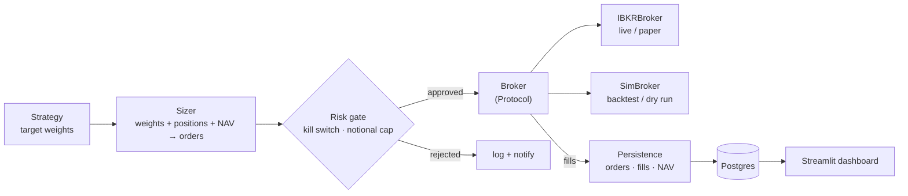
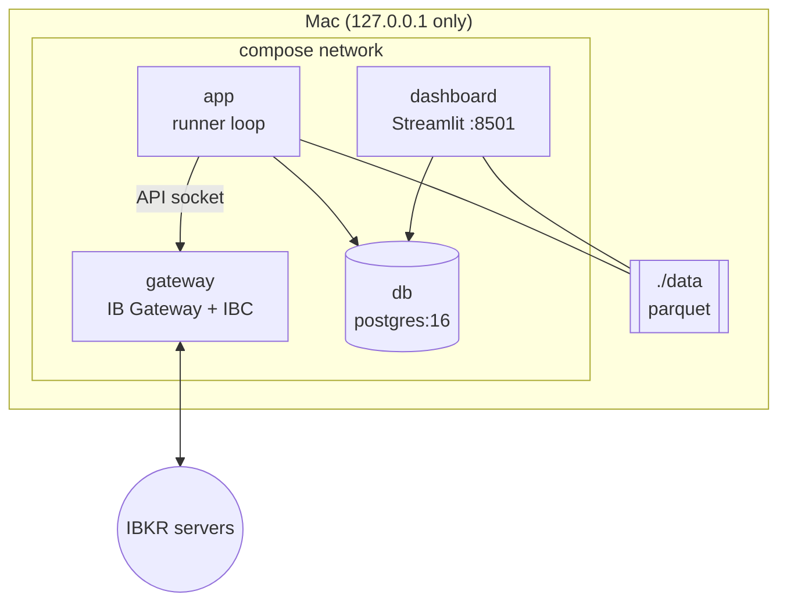

# tradebot — architecture

Personal automated trading bot: Interactive Brokers (paper by default), Postgres for state,
Streamlit for a read-only dashboard, and a sim broker so the same strategy code backtests
and trades live. Status as of 2026-09-18 (target portfolio: 10 ETFs across EUR, USD and CAD).
Nothing has traded a real order; the IBKR path is untested against a live gateway.

## The one idea

**Strategies return target weights, never orders.** Everything downstream — sizing, risk,
execution — is shared between backtest and live, so a strategy cannot behave differently in
the two.

## One runner cycle (`execution/runner.py`)

Every `POLL_INTERVAL_SECONDS` (300 s):

1. `broker.is_connected()` — if false, **skip the cycle** (gateway restarting / waiting on 2FA).
2. `broker.nav()` and `broker.positions()`; write a `NavSnapshot`.
3. `strategy.target_weights(now, ctx)`.
4. `prices_in_base`: latest price per symbol via `broker.price()`, converted to the base
   currency with `broker.fx_rate()`. Unregistered or unpriced symbols are left alone.
5. `size_orders(..., whole_shares=True)` turns the weight gap into whole-share orders
   (truncated toward zero; skips trades under 1.0 notional).
6. **Market-hours guard:** drop orders for symbols whose exchange isn't in its regular
   session (`broker.is_market_open()`, from IBKR's `liquidHours` in the exchange's time zone).
   Unknown counts as closed.
7. **Open-order guard:** drop any order for a symbol that already has a working order at the
   broker (`broker.open_order_symbols()`, which includes orders from other clients and market
   orders queued while an exchange is closed). If the broker can't say, the cycle fails and
   places nothing.
8. `check_orders(...)` — rejects on kill switch, missing price, or notional above
   `MAX_NOTIONAL` (500, in the base currency). Rejections are logged (and sent to `notify`).
9. `broker.place(approved)` → fills → `record_orders_and_fills`.

Startup runs `reconcile(broker)` once: the DB `positions` table is overwritten to match the
broker. Broker is the source of truth; never the reverse.

## Modules (`src/tradebot/`)

| Module | Role |
|---|---|
| `instruments.py` | Registry: symbol → currency, IBKR exchange, primary exchange, Yahoo ticker |
| `portfolio.py` | Target weights: 50% sleeve + 50% 60/40, with 5% moved into EUR-hedged classes |
| `broker/base.py` | `Broker` Protocol (incl. `price`, `fx_rate`) + `Order`, `Fill`, `Position`, `Bar` |
| `broker/ibkr.py` | `ib_async` client; contracts from the registry; `check_setup()` at startup |
| `broker/sim.py` | In-memory broker, instant fills at the last set price, no slippage |
| `strategy/` | `Strategy` Protocol; `ConstantWeightStrategy` fed by `portfolio.blended_weights()` |
| `execution/sizer.py` | Pure function: weights + positions + NAV + prices → orders |
| `execution/runner.py` | The loop above; best-effort DB writes via `_persist` |
| `risk.py` | Pre-trade checks; fails closed |
| `state/models.py` | SQLAlchemy: `orders`, `fills`, `positions`, `nav_snapshots`, `overnight_days` |
| `state/persistence.py` | `record_nav`, `record_orders_and_fills` |
| `state/reconcile.py` | Startup sync of `positions` from the broker |
| `data/store.py` | Parquet bars per symbol (`/data/bars/<SYM>.parquet`), read through DuckDB |
| `data/sources/` | `ibkr.py` (daily bars; read-only `download_daily_bars` of completed sessions) and `yfinance.py` (bars in calendar days; FX spot) |
| `execution/overnight_runner.py` | The SPY slice as its own process (own IBKR client id, compose service `overnight`): one binary, volatility-aware decision at 15:00 ET, MOC entry of the whole slice, exit only after a confirmed fill. Idempotent via the `overnight_days` table |
| `paper.py` | Research tables (accounting, metrics, sensitivities) behind `graphics_paper/` |
| `overnight.py` | SPY overnight research ported from `archive/ibkr_overnight.py`: MLE signal, backtest, next-session plan, spread screen. Never submits orders (`order_plan` returns `transmit=False` plans that brokers refuse). CLI: `research/overnight.py` |
| `backtest.py` | Daily-rebalance backtest on `SimBroker`; CAGR, drawdown, Sharpe |
| `notify.py` | Telegram push; logs instead when unconfigured (deferred) |
| `config.py` | pydantic-settings, reads env / `.env` |
| `dashboard/app.py` | Streamlit: NAV line, positions, recent orders |

## Overnight trade (separate process) - the SPY slice

The portfolio's SPY slice (27% of NAV) belongs to one daily rule and the portfolio runner never
touches SPY (`OVERNIGHT_MANAGED`: not a target, not counted in positions). `overnight_runner`
ticks every 30 s. Each trading day (session times come from IBKR's hours, so holidays and early
closes are handled) it decides at exactly **60 minutes before the close (15:00 ET)**, an instant
it stores (an optional random delay up to 45 min is available, off by default). At that moment the
model (`overnight.next_signal`) uses the overnight and daily variances it already had plus **today's
realized intraday volatility from the open to the decision instant** (5-minute bars, only bars that
had completed by then, scaled to a full session). It answers either "hold the WHOLE slice overnight"
or "do nothing with SPY today" (binary: the sized weight must be at least `OVERNIGHT_MIN_WEIGHT`).

- yes: BUY MOC for the whole slice (`0.27 x NAV`, price buffer 1%), gated by the kill switch and
  the per-order cap;
- after the entry is CONFIRMED filled by IBKR's executions (never alongside it): SELL at the
  opening auction (OPG), or a plain market sell if the open is already here;
- an unfilled OPG exit is escalated to a market sell 5 minutes after the open.

Every order is preceded by a `submitting` status in `overnight_days`, so a crash or restart never
double-places; an unknown placement outcome is left for a human. Too few intraday bars means retry
until the MOC cutoff and then MISSED; nothing is ever traded blind.

## Research figures

`research/paper_export.py` -> `graphics_paper/data/*.csv` -> `graphics_paper/render.py` ->
`graphics_paper/figures/`. Pure logic in `tradebot/paper.py` (accounting) and
`tradebot/overnight.py` (model); see `graphics_paper/README.md`.

## Currency model

NAV, sizing and the per-order cap (`MAX_NOTIONAL`) are all in `BASE_CURRENCY` (default EUR),
which must match the IBKR account's currency; `check_setup()` enforces it. ETFs quote in
their own currency (EUR on Xetra, USD for SPY/TLT/PAVE, CAD for XUT), so prices are converted
to the base currency before sizing. USD/CAD exposure is otherwise unhedged, apart from the
5% held in EUR-hedged share classes (IUSE, DTLE). The backtest applies the same conversion
using Yahoo FX pairs (`EURUSD=X`, `EURCAD=X`).

## Deployment (`docker-compose.yml`)

- Gateway ports 4001 (live) / 4002 (paper) and the dashboard's 8501 bind to `127.0.0.1` only.
- `AUTO_RESTART_TIME` restarts the gateway daily at 11:45 PM; expect a few minutes of
  `is_connected() == False`, which the runner treats as a no-op.
- `pgdata` is the only named volume.

## Invariants worth keeping

- Strategies never emit orders; sizing lives in one place.
- Risk gate fails closed and sits directly before `broker.place()`.
- Broker state wins over DB state, always.
- A disconnected broker means do nothing, never guess.
- Plan-only orders (`transmit=False`) are never placed, and a batch is fully validated before any order is sent.
- Never place an order for a symbol that already has one working (positions only change on fill).
- Only trade a symbol while its own exchange is open; never queue market orders overnight.
- DB writes after a trade are best-effort: log and continue, since the order already exists.
- `IB_MODE` stays `paper`.

## Testing

`uv run pytest` — 120 tests plus 3 Postgres-backed persistence tests that run when
`TEST_POSTGRES_URL` is set (schema built by the real Alembic migration). Backtests are tested
offline through an injectable `fetch_bars`.

## Not built / not verified

- Fills: no order has filled yet (first paper orders were queued while every market was closed).
- The overnight trade has never placed an order: MOC/OPG routing through SMART is untested at
  IBKR (the first live paper day will be the test).
- The target weights are a first draft, not a validated allocation.
- `positions` is only synced at startup, not after each fill.
- Fills and cancellations that arrive after `place()` returns are never written to the DB;
  those orders stay `submitted` in the dashboard.
- Telegram (deferred), CI, git.
- Backtest has no slippage or commissions.
