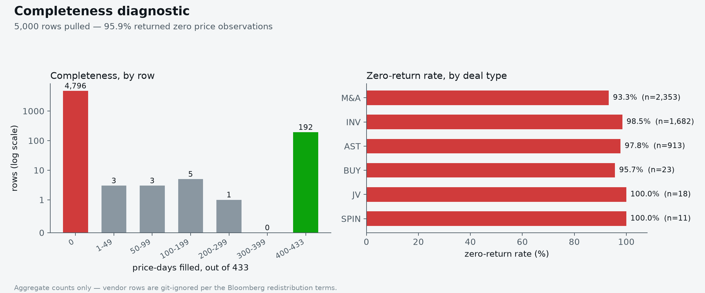

# market-surveillance

Two pieces of what a market-surveillance and transaction-reporting team does, on real reference
data where possible.

| Module | What it does | Status |
|---|---|---|
| `marketsurv.surveillance.event_study` | Pre-announcement screen for possible insider dealing: market-model abnormal return and abnormal volume before takeover announcements | Working on synthetic data; waiting on Bloomberg pull |
| `marketsurv.reporting.rts22` | Equity subset of the MiFIR RTS 22 transaction report with per-field validation (LEI mod-97, ISIN Luhn, MIC, UTC timestamps) | Working; XML serialisation and XSD validation not done |
| `marketsurv.reporting.reconcile` | Reconciles internal trade records against ARM acknowledgements (missing, unexpected, rejected, quantity/price mismatches) | Working |
| `marketsurv.data.bloomberg` | Bloomberg Desktop API pull layer (via `xbbg`) writing to `data/raw/` | Untested: needs a Terminal |

## Run

```bash
uv sync
uv run pytest
```

Bloomberg pulls need the extra and a logged-in Terminal: `uv sync --extra bloomberg`. What to
pull is in `docs/bloomberg-pull.md` (kept locally, not tracked: see below).

## Pull 1, diagnosed

The first Bloomberg export came back almost empty: 95.9% of 5,000 rows returned zero price
observations, uniformly across deal types (93-100%) rather than concentrated in delisted
tickers, which points at a formula/entity-reference bug rather than data availability. Pull 3
fixed it and is what `scripts/run_event_study.py` runs against.



Regenerate from a raw pull (aggregate output only - safe to commit even though the input isn't):

```bash
uv run --extra plots python scripts/plot_pull_diagnostics.py data/raw/datapull_1.csv figures/pull1-diagnostic.png
```

## Limits, stated up front

- An abnormal pre-announcement run-up is a reason to look, not evidence of abuse. Leaks, rumours
  and sector news look the same. Results will be reported as flag rates against a matched control
  sample, not as detected insiders.
- Bloomberg has no order-level data, so spoofing and layering are out of scope.
- The RTS 22 module is a learning implementation of a subset of the 65 fields. Check it against
  the current ESMA reporting instructions and schema before treating it as authoritative.
- Vendor data is licensed: `data/raw/` is git-ignored, and only scripts and aggregate results
  belong in the repo. `docs/bloomberg-pull.md` and `docs/data-pull-checklist.md` (personal
  pull-process notes) are git-ignored too; the pull layer and its script (`scripts/pull_bloomberg.py`,
  `src/marketsurv/data/bloomberg.py`) are not.

## Next

1. Run the Bloomberg pull; run the screen on real events and a control sample; report flag rates.
2. Build a small label set from public enforcement cases and check recall.
3. RTS 22: ISO 20022 XML output, XSD validation against the ESMA schema, and a report generator
   that samples real ticks as a hypothetical firm's executions.
4. Optional: marking-the-close screen on intraday bars; HMM regime baseline for the volume series.
