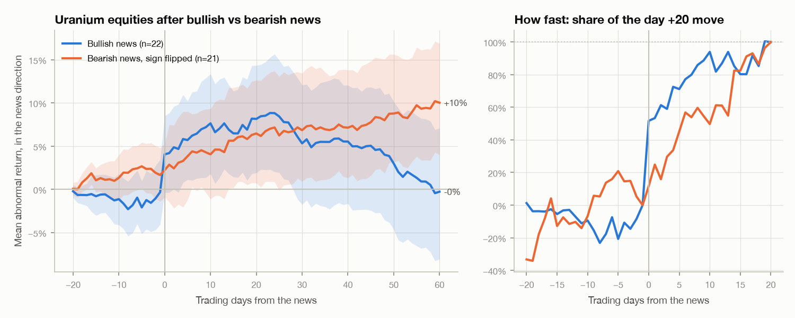

# Uranium signatures

A pet project on how news about uranium gets into prices. The question: if bearish news
(reactor closures, phase-outs) leaves a recognisable **signature** in how prices move, is the
signature for bullish news (supply cuts, restarts, reactor deals) the **mirror image**? And if
some traders know first, what footprints would they leave?

Uranium is a hard market for this. Spot is a weekly assessment built from a few trades, and most
volume is in long-term contracts. So the timing work uses **tradeable daily proxies**: Cameco
(CCJ), Denison (DNN), NexGen (NXE) and the URA ETF. The Sprott Physical Uranium Trust stands in
for the physical price from 2021.

**Start with [docs/PRIMER.md](docs/PRIMER.md).** It explains the results and the maths behind
them (event studies, partial adjustment, lead-lag, the averaging trap, the Kyle model, screening
for insider footprints) as a short primer on price discovery.

This is research, not a trading signal.

## The plan

| Stage | Question | Status |
|---|---|---|
| 1. Event catalog + signatures | How fast do uranium equities price bearish vs bullish news? | Done, on a source-checked catalog |
| 2. Speed | Half-lives; equities vs the physical trust vs monthly spot | Done |
| 3. Sprott regime split | Did the trust's buying since 2021 change the signatures? | Skipped for now |
| 4. Backtest | Is the drift tradeable, walk-forward, after costs? | Done: suggestive, not established |
| 5. Informed-trading screen | Do prices and volume move before news that someone could have known first? | First pass done on daily data, with the [`market-surveillance/`](../market-surveillance) thresholds; options and intraday data next |

## Results so far



- **The signatures are not mirror images.** Bullish news is half-priced in **1.7 days**,
  bearish news in **13.5 days** (bearish is slower in 84% of bootstrap draws). The difference
  is all in the first two days: +4.5% vs +1.2% (p = 0.07). After that, both drift about +4% by
  day 20.
- **The missing bearish jump belongs to small, local news.** US plant closures barely move on
  the day. The big bearish shocks, Fukushima and DeepSeek, jumped as hard as any bullish news.
  Among events with a confirmed release time, the jump gap shrinks to +0.9%. Direction and size
  of news are confounded in this sample.
- **Physical vs paper.** Daily, about 80% of the equity–trust co-movement is same-day, with
  small lags both ways. Against monthly spot, Cameco appears to lead by a month, but that is
  mostly because spot is a monthly *average*. Average Cameco the same way and the lead is gone.
- **Backtest.** The strategy skips the day 0–1 jump and tries to collect the drift after it.
  At the close of day 1 it buys the uranium basket after bullish news or shorts it after bearish
  news, hedges out the S&P 500 and energy moves with the basket's betas, and closes at day 20.
  It trades an event only if earlier events of the same kind drifted by more than the costs, so
  every decision uses past data only. Result: 33 trades, 61% winners, +3.1% net per trade,
  t = 1.4. Only 7% of random books do as well, but two COVID-crash trades carry half the
  profit, and the events were picked by hand after the fact. [Primer §7](docs/PRIMER.md) has the
  step-by-step rules and two worked trades.
- **Insider footprints: none found.** The screen looks for a price run-up in the news
  direction plus abnormal volume over the 10 sessions before the news, in the uranium basket
  and in the directly affected stock. It flags 0 of 43 basket windows and 1 of 18 single-stock
  windows. The one flag (Centrus, November 2024) traces to public news: FERC's rejection of the
  Talen–Amazon deal and the US election. Events someone could have known first show no more
  run-up than random days. Events nobody could know show *more*, from public anticipation.
  The screen only sees run-ups above about 13–21% with 2–3× volume, so a careful insider would
  pass. [Primer §8](docs/PRIMER.md) covers the method, the Section 232 leak that looked like
  insider trading until its timestamp was fixed, and what to do next (options first).

Full output: [docs/RESULTS.md](docs/RESULTS.md).

## The event catalog

[`data/events.csv`](data/events.csv) has 48 events from 2011–2025: 22 bullish, 21 bearish,
and 5 military or treaty events. Each has a direction, a channel (supply, demand, policy or
military), whether it was a surprise or scheduled, the **release session** (before the open,
intraday, after the close, weekend, or unknown), whether anyone could have **known it first**,
the **directly affected stock** if there is one, a note, and a source.

Every date was checked against a primary or news source in September 2026. The check changed
several rows:

- Both Cameco McArthur River releases (2017, 2018) came out **after the close**, so their
  day 0 moved one session later.
- The Section 232 decision (2019) was officially released after Friday's close, but press
  reports moved prices during Friday's session, so day 0 is that Friday. The first public
  report counts, not the official release.
- The McArthur River restart was on 9 February 2022, not the 8th.
- California's Diablo Canyon extension passed late on 31 August 2022, after the close.
- The 2019 TMI-1 item only confirmed a closure first announced on **30 May 2017**. That date
  was added as the surprise, and the 2019 item relabelled as scheduled.
- Kazatomprom's 2026 production cut (22 August 2025) was added.
- FERC's rejection of the Talen–Amazon co-location deal (1 November 2024, after the close) was
  added after the insider screen turned it up.

For 17 events the time of day could not be pinned down (`unknown`), and 9 well-known events
have no source link because it was not re-opened. The main window, days 0–1, absorbs a one-day
timing error.

## Method, briefly

For each event and each name, a market model on SPY and XLE is estimated over trading days
−280 to −30. The abnormal returns are averaged over the available names and sign-flipped for
bearish news. A partial-adjustment curve fitted to the mean path gives the half-life. Lead-lag
uses cross-correlations and distributed-lag regressions. The backtest only uses events whose
20-day window had ended before each trade. Bootstraps resample events. [The primer](docs/PRIMER.md)
has the formulas.

## Running it

```bash
uv sync
uv run pytest
uv run python scripts/us.py run --refresh   # event study; downloads prices to data/cache/
uv run python scripts/us.py speed           # half-lives and lead-lag
uv run python scripts/us.py backtest        # walk-forward backtest
uv run python scripts/us.py insider         # pre-announcement footprint screen
uv run python scripts/us.py events          # one row per event
```

`scripts/us.py` puts `src/` on the path itself. On macOS with Python 3.13, the editable
install's `.pth` file can end up flagged hidden, and Python then skips it (TaxHarvest has the
same issue), so the `uransig` entry point may not be found.

The tests check the estimator on synthetic data: a known jump reads as fast and a known drift
as slow, the fitted half-life is recovered, a one-day lead is detected, and after-close news
moves day 0. They also check Working's 0.25 autocorrelation of averaged random walks, and
that the footprint screen flags an injected run-up but not a quiet window.
