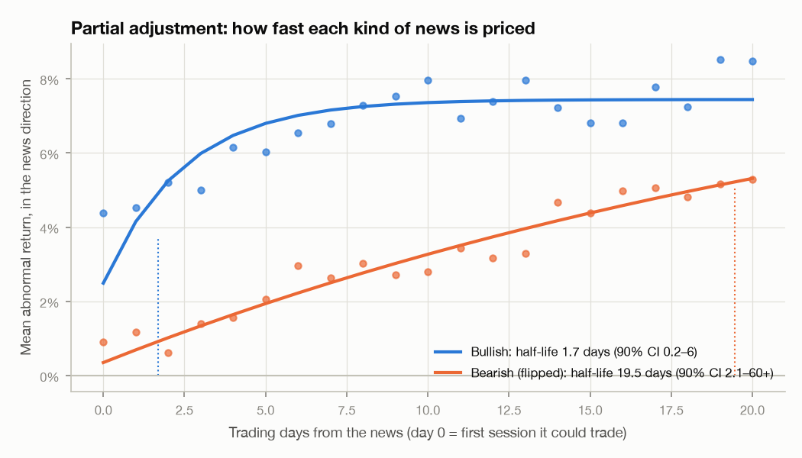
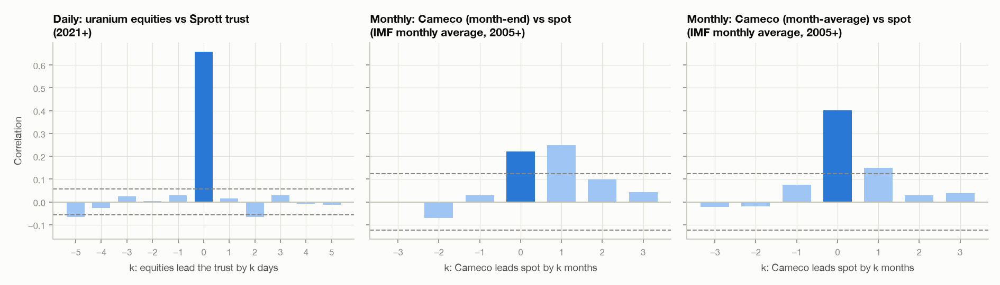
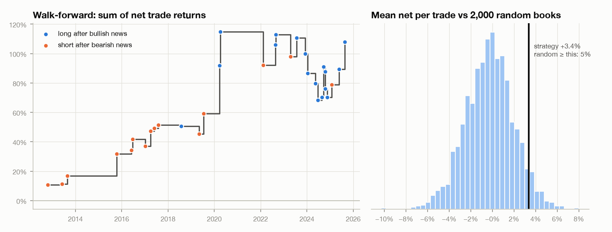

# How news gets into a price

*A primer on price discovery, worked through one thin market: uranium.*

## What this field is called

The question "how fast does news spread through a market?" is studied in **market
microstructure**. Its subfield **price discovery** asks where and how fast new information
becomes a price. Two neighbouring fields supply the tools: **information economics**
(who knows what, and how prices reveal it) and the **event study** from empirical finance.
What this project first called "information dissipation" is usually called information
*diffusion* or *incorporation*.

It is not Shannon's information theory, although the two meet in one place, the Kyle model
([§6](#6-a-bridge-to-information-theory-the-kyle-model)). There a price can literally be said
to carry half a bit of an insider's secret.

## The short version

| Question | Answer in this data | How sure |
|---|---|---|
| Are good and bad uranium news priced at the same speed? | No. Bullish news is half-priced in **~2 days**, bearish news in **~3–4 weeks**. The whole gap is the day-0/1 jump; both drift alike afterwards | Suggestive (p ≈ 0.09) |
| Is bad news always slow? | No. Fukushima and DeepSeek jumped as hard as any bullish news. The missing jump sits in small, local closure news | Clear from the per-event table |
| Does the physical price lag the equities? | Daily: barely, ~80% of the joint move is same-day. Monthly: an apparent 1-month lag is mostly an **averaging artifact** | Clear |
| Can you trade the slow drift? | +3.4% per trade after costs in a walk-forward test, but t = 1.5 and two COVID trades carry half of it | Not established |

The rest of this document explains how each number is made.

---

## 1. Returns, and what "abnormal" means

Prices are turned into **log returns**, $r_t = \ln P_t - \ln P_{t-1}$. They add up over time: the
return from day $a$ to day $b$ is $\sum_{t=a}^{b} r_t$.

A uranium stock moves for many reasons at once: the whole market, energy stocks, and uranium
news. To isolate the news, fit a **market model** on a quiet stretch *before* the event:

$$
r_{i,t} = \alpha_i + \beta_{i}^{\text{SPY}} \, r_t^{\text{SPY}} + \beta_{i}^{\text{XLE}} \, r_t^{\text{XLE}} + \varepsilon_{i,t},
\qquad t \in [-280, -30].
$$

Here $t$ counts trading days relative to the event. The window stops 30 days before the
news, so the news cannot leak into the estimate of "normal". Around the event, the **abnormal
return** is what the model did not predict:

$$
AR_{i,t} = r_{i,t} - \hat\alpha_i - \hat\beta_{i}^{\text{SPY}} r_t^{\text{SPY}} - \hat\beta_{i}^{\text{XLE}} r_t^{\text{XLE}}.
$$

Averaging over the four uranium proxies (Cameco, Denison, NexGen, and the URA ETF) gives one
$AR_t$ per event. Summing it over a window gives the **cumulative abnormal return**:

$$
CAR(a, b) = \sum_{t=a}^{b} AR_t .
$$

**Day 0** is the first session in which the news could trade. That is why each event in the
catalog records *when* it came out. The Section 232 decision was released after the Friday
close on 12 July 2019, so its day 0 is Monday the 15th. Getting day 0 wrong by one day moves the
jump into the "pre-drift" window and makes the market look either psychic or slow.

To compare good and bad news on one axis, bearish events are **sign-flipped**: multiply by
$s = -1$. "Up" then always means "moved the way the news points".

## 2. Signatures: why a single event says almost nothing

On a random day with no news, one event's 20-day $CAR$ has a standard deviation of about
**13%** (placebo run, 500 random days). That is larger than most of the effects we are
looking for. Averaging $N$ independent events shrinks the noise like $1/\sqrt{N}$:

$$
\text{SE}\big(\overline{CAR}\big) \approx \frac{\sigma}{\sqrt{N}} \approx \frac{12.8\%}{\sqrt{20}} \approx 2.9\%.
$$

So with 20 events, only effects of roughly 5% or more can be told apart from luck. This is the
central constraint of the whole project.

A **signature** is the average signed CAR path of a group of events:

*Left: mean abnormal return in the news direction, bullish (blue) and sign-flipped bearish
(orange), with 90% bootstrap bands. Right: the same paths scaled to their day +20 value. Blue
reaches half its move on the day of the news; orange gets there much later.*

**How the bands and p-values are made: the bootstrap.** There are too few events to trust a
normal approximation. Instead, resample the events with replacement 5,000 times and recompute
the statistic each time. The spread of those 5,000 values is the uncertainty (Efron, 1979). A
difference between bull and bear is called "significant at 10%" when fewer than 10% of the
resampled differences have the other sign on either side of zero.

| Window (verified catalog, 22 bull / 20 bear) | Bullish | Bearish, flipped | Difference, 90% CI | p |
|---|---|---|---|---|
| Days −20 to −1 | −0.3% | +2.0% | −2.3% [−7.5, +2.8] | 0.46 |
| **Days 0–1** | **+4.5%** | **+1.2%** | **+3.4% [+0.2, +6.4]** | **0.09** |
| Days 2–20 | +4.0% | +4.1% | −0.2% [−5.7, +5.5] | 0.92 |
| Share of the 20-day move by day 1 | 53% | 22% | | 0.17 |

## 3. Speed as a single number: partial adjustment and half-life

The simplest model of slow pricing is **partial adjustment**. Suppose the news moves the
fair value by $A$, and each day the price closes a fixed fraction $\kappa$ of the remaining
gap. After day $t$ (day 0 counted as the first step), the share still missing is
$(1-\kappa)^{t+1}$, so

$$
CAR(0, t) = A \left[1 - (1-\kappa)^{t+1}\right].
$$

The **half-life** is the time until half the move is in. Setting the missing share to one half,

$$
(1-\kappa)^{h} = \tfrac12 \quad\Longrightarrow\quad h = \frac{\ln \tfrac12}{\ln(1-\kappa)}.
$$

A market that prices news in one step has $\kappa \to 1$ and $h \to 0$. A market that never
catches up has $\kappa \to 0$ and $h \to \infty$. The same algebra gives the half-life of
radioactive decay and of an AR(1) pricing error in a cointegration model. The **error-correction
half-life** used in the benchmark-vs-satellite literature is exactly this number.

*Dots: mean signed CAR from day 0. Lines: least-squares fit of the partial-adjustment curve.
Dotted verticals: half-lives.*

| | Total move $A$ | $\kappa$ per day | Half-life | 90% CI |
|---|---|---|---|---|
| Bullish | +7.4% | 0.34 | **1.7 days** | 0.2 – 5.7 |
| Bearish (flipped) | +10.1% | 0.035 | **19.5 days** | 2.1 – 69 |

Bearish is slower than bullish in 88% of the bootstrap draws. The intervals are wide because
$h$ is a steep function of $\kappa$ near zero: a small change in $\kappa$ from 0.035 to 0.01
moves $h$ from 20 to 69 days. The curve also misses the bullish day 0, where the actual jump
is larger than a constant-rate model allows. Real news is a jump followed by a drift, not a
pure exponential. Two parameters are all 20 events can support.

## 4. Why bad news might travel slowly, and why here it mostly doesn't

The theory offers several reasons for an asymmetry:

- **Short-sale constraints.** Diamond & Verrecchia (1987) show that when shorting is costly,
  traders holding bad news cannot act on it as easily as traders holding good news, so prices
  adjust more slowly to bad news. Small uranium developers are expensive to short.
- **Gradual diffusion.** Hong & Stein (1999) model investors who each see a piece of the news
  at a different time. The price then drifts until everyone has seen it. Hong, Lim & Stein
  (2000), in a paper titled *Bad News Travels Slowly*, find this drift is strongest for bad news
  in small stocks with few analysts.
- **Physical market structure.** In uranium, bullish supply shocks force utilities to buy,
  which moves prices at once. Bearish demand news mostly means utilities quietly *stop* buying
  and producers hold inventory. No one is forced to sell, so the price sags.
- **Inattention.** DellaVigna & Pollet (2009) find that news released when investors are
  distracted (their test: earnings on Fridays) is priced more slowly.

**What the per-event table says.** First, the asymmetry is all in the **jump**. After day 1,
bullish and bearish news drift by the same amount: +4.0% and +4.1% over days 2–20. Both keep
moving for weeks. The difference is whether there is a jump first.

Split the bearish events, and the missing jump concentrates in one group:

| Bearish events | n | Days 0–1 | Days 2–20 |
|---|---|---|---|
| US plant closures and new-build failures | 10 | +0.3% | +4.5% |
| Other bearish news (phase-outs, policy, shocks) | 10 | +2.1% | +3.7% |

- The two largest bearish shocks, **Fukushima** (+21% flipped on days 0–1) and **DeepSeek**
  (+11%), jumped as hard as any bullish news.
- The **plant-closure announcements** (Kewaunee, San Onofre, Vermont Yankee, Pilgrim and others)
  barely register on the day. They are small and local, and most have no confirmed release time.
- The German and Swiss phase-outs and the Section 232 decision also barely jumped, then
  drifted 10–17% over the following month.
- Restricted to the 25 events whose release session is confirmed, the bull–bear jump gap
  drops from +3.4% to **+0.7%**.

So in this sample, the better description is "**big global news jumps; smaller or
harder-to-read news barely moves on the day; almost everything keeps drifting afterwards**".
Bullish uranium news happens to be mostly big and unambiguous (supply cuts, hyperscaler deals).
Bearish news is mostly small or slow-burning. Direction and size are confounded. Telling them
apart would take a larger catalog with a size or attention measure, such as news count or
search volume.

## 5. Speed between markets: lead-lag, and the averaging trap

The second kind of speed is **between** markets: does news reach uranium equities first and the
physical price later, or the other way round?

**Cross-correlation.** For two return series $x$ and $y$,

$$
\rho(k) = \operatorname{corr}(x_t,\; y_{t+k}).
$$

With a positive $k$, a large $\rho(k)$ means $x$ *leads* $y$ by $k$ periods. Under no relation,
$\rho(k)$ is roughly normal with standard error $1/\sqrt{n}$. The dashed lines below are at
$\pm 2/\sqrt{n}$.

**Distributed lags.** Correlations are symmetric and ignore each series' own memory. A cleaner
test regresses the follower on current and past values of the leader, *and on its own past*:

$$
y_t = c + \sum_{k=0}^{K} b_k \, x_{t-k} + \sum_{k=1}^{K} g_k \, y_{t-k} + e_t .
$$

The share $b_0 / \sum_k b_k$ is the fraction of the response that happens at once. The joint
size of $b_1, \dots, b_K$ tests whether the leader adds information beyond the follower's
own history. This is Granger causality, and in spirit the same question as Hasbrouck's (1995)
**information share**.

*Left: daily uranium equities vs the Sprott Physical Uranium Trust, a traded claim on physical
pounds (2021+). Middle and right: Cameco vs the IMF monthly spot price, with Cameco measured at
month-end (middle) or averaged over the month like spot (right).*

**Daily, 2021 onward (n = 1,245).** The same-day correlation is 0.66, and about **80%** of the
response is same-day in either direction. Small but significant lags run *both* ways (t = 2.6
and 2.8). Each market carries a little news the other picks up the next day. This is
feedback, not a clean leader.

**Monthly, 2005 onward (n = 258).** The middle panel seems to show Cameco leading spot by a
month: the correlation at $k = 1$ (0.25) beats the same-month one (0.22), and the lag
regression is significant (t = 3.0). The right panel shows that this is mostly the **averaging
trap**.

The IMF series is a *monthly average* of spot assessments. Working (1960) showed that if a
price is a random walk and you average it over $n$ points in each period, the changes between
averages are autocorrelated even though the underlying changes are not:

$$
\rho_1 = \frac{n^2 - 1}{2\,(2n^2 + 1)} \;\xrightarrow{\;n \to \infty\;}\; \frac14 .
$$

With about 21 trading days per month, $\rho_1 \approx 0.25$. The measured spot autocorrelation
is 0.30. An average is also centred mid-month, so it trails a month-end price by about half a
month *by construction*. Average Cameco the same way and the "lead" drops to 0.15 and stops
being significant (t = 0.4). Much of the apparent slowness of spot is in how it is recorded,
not in how the market learns. This is the stale-price problem that Dimson (1979) and
Scholes & Williams (1977) corrected betas for. `tests/test_speed.py` checks the 0.25 result
numerically.

## 6. A bridge to information theory: the Kyle model

Kyle (1985) models one insider who knows an asset's true value $v \sim N(p_0, \Sigma_0)$,
noise traders who trade randomly, and a market maker who sees only total order flow $y$ and
sets the price $p = p_0 + \lambda y$. In the one-period equilibrium,

$$
\lambda = \frac{1}{2}\,\frac{\sqrt{\Sigma_0}}{\sigma_u},
\qquad
\operatorname{Var}(v \mid p) = \frac{\Sigma_0}{2}.
$$

The insider trades just enough that the price reveals **half** of the uncertainty about $v$.
For Gaussian variables, the mutual information between the value and the price is

$$
I(v; p) = \tfrac12 \log_2 \frac{\Sigma_0}{\operatorname{Var}(v \mid p)} = \tfrac12 \log_2 2 = \tfrac12 \text{ bit}.
$$

That is where "information" in the Shannon sense meets price discovery. In Kyle's continuous-time
version, the insider spreads trading out so that the remaining uncertainty falls at a constant rate,
$\Sigma(t) = (1-t)\,\Sigma_0$, and is gone at the end. The price discovers the secret gradually
*on purpose*.

Two consequences matter here:

- $\lambda$, **Kyle's lambda**, is price impact per unit of order flow. It is high in thin
  markets like uranium, which pushes informed traders to trade slowly. That is one reason
  illiquid markets show drift.
- The same logic drives the **informed-trading checklist** planned as the next stage: if
  someone knows first, their trading leaves a pre-announcement run-up in price and volume.
  Meulbroek (1992) and Keown & Pinkerton (1981) measured exactly this footprint in insider
  trading cases. The pre-drift window above ($-20$ to $-1$) shows no reliable footprint yet.

## 7. Can the drift be traded? A walk-forward backtest

### The idea

The signatures show two phases. On days 0–1 the price jumps, if it jumps at all. From day 2
to day 20 it keeps drifting the same way, by about +4% on average for both bullish and bearish
news. The jump is gone by the time anyone reads a headline, so the strategy skips it and tries
to collect only the **drift**. It is a "follow the news, late" strategy: buy after good news,
sell short after bad news, but only once the first reaction is over.

### What the position is

- **The basket:** equal amounts of Cameco (CCJ), Denison (DNN), NexGen (NXE) and the URA ETF,
  or whichever of them existed at the time.
- **The hedge:** an opposite position in the S&P 500 (SPY) and the energy sector (XLE), sized by
  the basket's betas (§1). Uranium stocks rise and fall with the whole market. The hedge removes
  that part, so what is left is the uranium-specific move, the abnormal return. In dollars: for
  every \$100 of basket, the hedge is \$100 × β in each index.

### The steps, for every event in the catalog, in date order

1. News arrives. Day 0 is the first session in which it can trade.
2. **Do nothing on days 0 and 1.** That is the jump.
3. **At the close of day 1,** after bullish news, buy the basket and sell the hedge. After
   bearish news, sell the basket short and buy the hedge. Every trade is the same size.
4. **At the close of day 20,** about four weeks later, close everything.
5. **Filter:** only trade if earlier events of the same kind, whose 20 days are already
   over, drifted on average by more than the trading cost. Before at least 5 such earlier
   events exist, don't trade at all. This keeps the backtest honest: each decision uses only
   what was known on that day.

In practice, the filter always said yes once it had 5 events to look at. So the rule
amounts to: **trade every bullish and bearish event after the first five of each kind.**
The 10 warm-up events are the five 2011–2012 bearish events (Fukushima to Japan's 2012
strategy) and the five bullish events from 2015 to January 2018. The 5 military events are
never traded. That leaves 32 trades. Trades can overlap: in autumn 2024, up to three were
open at once.

**Costs:** 0.10% per side on the basket, so 0.20% per round trip, plus 2% a year for borrowing
the shares on short trades. That is about 0.15% over the four weeks.

**How profit is counted:** each trade earns the basket's abnormal return from day 2 to day 20,
minus costs. The chart below simply adds up these per-trade returns. There is no compounding,
and each trade counts equally. With 32 trades of equal size, "+3.4% per trade" means that on
average each \$100 committed earned \$3.40 over its four weeks.

### Two real trades

| | Section 232 decision (bearish) | Microsoft–TMI restart (bullish) |
|---|---|---|
| News | Released after the close, Fri 12 Jul 2019 | Before the open, Fri 20 Sep 2024 |
| Day 0 | Mon 15 Jul | Fri 20 Sep |
| Enter at the close of day 1 | Tue 16 Jul: **short** basket, buy hedge | Mon 23 Sep: **buy** basket, short hedge |
| Exit at the close of day 20 | Mon 12 Aug | Fri 18 Oct |
| Basket move over the trade | −20.4% | +23.8% |
| Market over the same days (SPY / XLE) | −4.0% / −7.9% | +2.6% / +1.4% |
| Basket betas (SPY / XLE) | 0.73 / 0.39 | 1.12 / 0.51 |
| Move the market explains | about −6% | about +3% |
| **Uranium-specific move (what the trade earns)** | **+14.2%** (the short gains) | **+20.8%** |
| After costs | +13.8% | +20.6% |

In July 2019 the market also fell, so an unhedged short would have earned partly for the wrong
reason. The hedge gives back that part and keeps only the uranium-specific move. (Returns are
log returns, which is why the pieces don't add up exactly as simple percentages would.)

### What it is not

It is not a news-reading system. It trades only the 47 events in the catalog, which I picked
and labelled after the fact. It doesn't trade the jump, doesn't size trades by conviction, and
doesn't trade on news that later turned out not to matter. That last point is the main reason
the results below are probably too good.

*Left: running sum of net trade returns. Right: the strategy's mean per trade against 2,000
books of the same number of trades on random days in a random direction.*

| | Trades | Hit rate | Mean net per trade | t-stat |
|---|---|---|---|---|
| All | 32 | 62% | **+3.4%** | 1.54 |
| Long after bullish | 17 | 53% | +4.5% | 1.31 |
| Short after bearish | 15 | 73% | +2.1% | 0.78 |
| At 50 bp per side | 32 | | +2.6% | 1.17 |

Only 4.9% of random books do as well. That sounds good, but read it with these caveats:

- **The events were chosen by hand, after the fact.** A list of memorable events favours
  news that moved prices, which inflates any "news" strategy. A live version would have to
  classify headlines as they arrive, and would also trade on news that went nowhere.
- **Two trades carry half the profit.** The COVID supply cuts (Cigar Lake +33%, Kazatomprom
  +23%) came during the March 2020 crash. Without them the mean falls to about +1.7%.
- **Trades overlap.** The four autumn-2024 trades all ride the same rally and fall. The
  random books draw independent days, so they understate how lumpy the real strategy is.
- **t = 1.5 on 32 trades** is not evidence of an edge. It is a reason to keep a larger,
  cleaner catalog going.

## 8. Where this leaves the uranium question

1. **Speed.** Bullish uranium news is half-priced within about two days. Bearish news in this
   sample takes weeks, because most of it has no jump. The missing jump belongs to small, local
   closure announcements; large bearish shocks jump. After the first two days, both kinds drift
   alike.
2. **Inverse signature.** The bullish signature is *not* the mirror of the bearish one in shape.
   Whether that is about direction or about size is not yet separable.
3. **Physical vs paper.** Equities and the physical trust price news mostly the same day.
   Monthly spot looks slow largely because it is an average.
4. **Tradeability.** Not shown. The honest reading is "worth watching", not "worth trading".

## Notation

| Symbol | Meaning |
|---|---|
| $r_t$ | log return on day $t$ |
| $AR_t$ | abnormal return: actual minus market-model prediction |
| $CAR(a,b)$ | sum of $AR_t$ from day $a$ to day $b$ |
| $s$ | sign of the news: +1 bullish, −1 bearish |
| $\kappa$, $h$ | daily adjustment share and half-life |
| $\rho(k)$ | cross-correlation at lag $k$ |
| $\lambda$ | Kyle's lambda, price impact per unit of order flow |
| $\Sigma_0$ | prior variance of the true value in the Kyle model |

## References

- DellaVigna, S. & Pollet, J. (2009). Investor inattention and Friday earnings announcements. *Journal of Finance* 64(2).
- Diamond, D. & Verrecchia, R. (1987). Constraints on short-selling and asset price adjustment to private information. *Journal of Financial Economics* 18(2).
- Dimson, E. (1979). Risk measurement when shares are subject to infrequent trading. *Journal of Financial Economics* 7(2).
- Efron, B. (1979). Bootstrap methods: another look at the jackknife. *Annals of Statistics* 7(1).
- Hasbrouck, J. (1995). One security, many markets: determining the contributions to price discovery. *Journal of Finance* 50(4).
- Hong, H., Lim, T. & Stein, J. (2000). Bad news travels slowly: size, analyst coverage, and the profitability of momentum strategies. *Journal of Finance* 55(1).
- Hong, H. & Stein, J. (1999). A unified theory of underreaction, momentum trading, and overreaction in asset markets. *Journal of Finance* 54(6).
- Keown, A. & Pinkerton, J. (1981). Merger announcements and insider trading activity. *Journal of Finance* 36(4).
- Kyle, A. (1985). Continuous auctions and insider trading. *Econometrica* 53(6).
- MacKinlay, A. C. (1997). Event studies in economics and finance. *Journal of Economic Literature* 35(1).
- Meulbroek, L. (1992). An empirical analysis of illegal insider trading. *Journal of Finance* 47(5).
- Scholes, M. & Williams, J. (1977). Estimating betas from nonsynchronous data. *Journal of Financial Economics* 5(3).
- Working, H. (1960). Note on the correlation of first differences of averages in a random chain. *Econometrica* 28(4).
