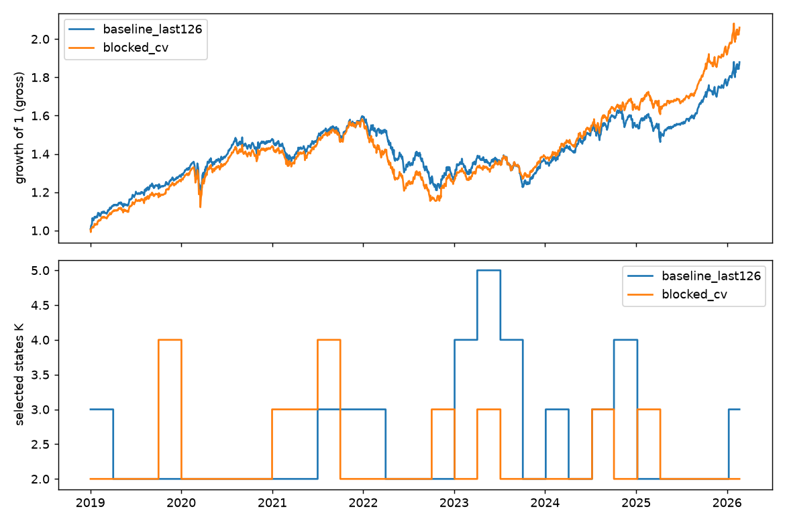
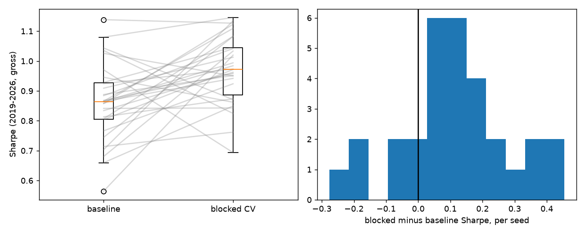

# Overfitting test: blocked validation for the HMM

This folder looks only at the **Gaussian-HMM** part of the paper replication (in [`../paper-replication`](../paper-replication)). It changes one thing: how the number of hidden states $`K`$ is validated.

**Outcome:** the blocked-validation change worked. Over 30 seeds it raised the mean Sharpe from 0.863 to 0.972 (paired gain +0.11, 95% CI +0.04 to +0.17; better in 24 of 30 seeds, p about 0.002), with fewer states chosen and about 30% less turnover. The effect is modest and comes mostly from 2023 to 2026 (details in Sections 5 and 6).

## 1. What was wrong with the original split

Every 63 trading days the replication re-chooses $`K\in\{2,\dots,6\}`$. It fits each candidate on all history except the newest 126 days, then scores it on those 126 days (`select_order` in `models.py`). Two weaknesses:

- **One window decides everything.** The newest 126 days are a single market episode. A $`K`$ that happens to suit that episode wins, even if it does badly elsewhere. That is the selection-overfitting risk we want to test.
- **It only ever looks at the end of the sample.** The validation regime is always "the most recent one", never an older one.

## 2. The new split

```text
|--train--|gap|TEST|gap|----train----|gap|TEST|gap|--train--| ... |gap|TEST (last 80 days)| today
```

- The **last 80 days** of history are always a test block, so the "most recent" check is kept.
- **Three further test blocks** of 80 days are placed at random positions (`config.py`: `random_blocks`, `block_len`).
- Around **every** test block, **60 days are purged** on each side (`gap_days`). Train and test never touch.
- A random layout is kept only if every remaining train segment has at least 120 days (`min_segment`). The layout is a deterministic function of `(seed, history length)`, so runs are reproducible, yet it changes every time the history grows.
- The backtest (out-of-sample) period now starts **2019-01-01** instead of 2023-06-02, so the selector is exercised on about 1,800 days including 2020 and 2022, not about 700.

**Why 60 days?** The features contain a 60-day rolling volatility (`volatility_window`). A day $`t`$ just after a test block shares up to 59 of its 60 inputs with the test days. Without a gap the model is trained on near-copies of what it is then tested on, which flatters the score. A purge of at least the feature window removes that overlap. This is the same idea as purged cross-validation in financial ML.

**No look-ahead.** All blocks, random or not, lie inside the history that ended the day before the decision date. Training on data that is *later* than a random test block is fine here: we are choosing a hyper-parameter ($`K`$), not forecasting the block, and the decision date is still after everything used.

Code: [`splits.py`](src/overfit_hmm/splits.py) (layout), [`selection.py`](src/overfit_hmm/selection.py) (scoring), [`run.py`](src/overfit_hmm/run.py) (backtest). The paper's `run_hmm` accepts a `selector` argument (default unchanged), which is how both variants run through identical code.

## 3. The maths behind the HMM

### 3.1 Markov chain (the hidden regime)

The market regime $`s_t\in\{1,\dots,K\}`$ is never seen. It evolves as a first-order Markov chain:

```math
P(s_t=j\mid s_{t-1}=i,\ s_{t-2},\dots)=P(s_t=j\mid s_{t-1}=i)=A_{ij},
\qquad \sum_j A_{ij}=1 .
```

Only the current regime matters for tomorrow. $`A`$ is the transition matrix and $`\pi_i=P(s_1=i)`$ the start distribution. A large diagonal $`A_{ii}`$ means regimes persist, which is why regimes are usable for allocation. The expected stay in state $`i`$ is $`1/(1-A_{ii})`$ days.

### 3.2 Emissions

Given the regime, the (standardized) feature vector $`x_t`$, which is 15-dimensional (returns, volatilities, momenta of five assets), is Gaussian:

```math
x_t\mid s_t=i\ \sim\ \mathcal N(\mu_i,\Sigma_i).
```

Parameters: $`\theta=(\pi,A,\{\mu_i,\Sigma_i\})`$. The number of free parameters is roughly $`K\big(d+d(d+1)/2\big)+K^2`$, and it grows quickly with $`K`$. That is why the score below carries a complexity penalty.

### 3.3 Bayes update (the filter used live)

Let $`\alpha_t(i)=P(s_t=i\mid x_{1:t})`$ be the belief about today's regime. Each day it is updated in two steps:

```math
\underbrace{\bar\alpha_t(j)=\sum_i \alpha_{t-1}(i)A_{ij}}_{\text{predict: push the belief through the chain (prior)}},
\qquad
\underbrace{\alpha_t(j)=\frac{\bar\alpha_t(j)\,\mathcal N(x_t;\mu_j,\Sigma_j)}{\sum_l \bar\alpha_t(l)\,\mathcal N(x_t;\mu_l,\Sigma_l)}}_{\text{update: Bayes' rule with the likelihood}} .
```

This is exactly Bayes' theorem, $`\text{posterior}\propto\text{prior}\times\text{likelihood}`$, with the prior supplied by the Markov chain. It is what `FittedRegimeModel.filter` does. It uses only data up to $`t`$, so it is causal. The denominator is the one-step predictive density $`p(x_t\mid x_{1:t-1})`$, and the sum of its logs over time is the **log-likelihood** of the sequence, which is the quantity we validate on.

### 3.4 Baum-Welch (how the parameters are learned)

Baum-Welch is Expectation-Maximisation for HMMs. Because $`s_t`$ is hidden, we alternate:

**E-step.** With the *forward* probabilities $`\alpha_t`$ (Section 3.3) and *backward* probabilities $`\beta_t(i)=p(x_{t+1:T}\mid s_t=i)`$ compute

```math
\gamma_t(i)=P(s_t=i\mid x_{1:T})=\frac{\alpha_t(i)\beta_t(i)}{\sum_l\alpha_t(l)\beta_t(l)},
\qquad
\xi_t(i,j)=P(s_t=i,s_{t+1}=j\mid x_{1:T})\ \propto\ \alpha_t(i)A_{ij}\,\mathcal N(x_{t+1};\mu_j,\Sigma_j)\,\beta_{t+1}(j).
```

**M-step.** Re-estimate with these soft counts:

```math
\hat A_{ij}=\frac{\sum_{t=1}^{T-1}\xi_t(i,j)}{\sum_{t=1}^{T-1}\gamma_t(i)},\quad
\hat\mu_i=\frac{\sum_t\gamma_t(i)x_t}{\sum_t\gamma_t(i)},\quad
\hat\Sigma_i=\frac{\sum_t\gamma_t(i)(x_t-\hat\mu_i)(x_t-\hat\mu_i)^\top}{\sum_t\gamma_t(i)},\quad
\hat\pi_i=\gamma_1(i).
```

Each iteration cannot decrease the likelihood, so it converges to a *local* optimum (hence the fixed seed and the iteration cap).

### 3.5 Baum-Welch on several separate blocks

With the purge, the training data is not one contiguous series but $`M`$ separate segments. Gluing them together would create fake transitions across a gap (the chain would "jump" from one year to another in a single day) and would corrupt $`\hat A`$. Instead the segments are treated as $`M`$ independent sequences (`lengths=` in hmmlearn):

- The E-step runs forward-backward **inside each segment**.
- The M-step **sums** the soft counts over all segments, for example $`\hat A_{ij}=\sum_m\sum_t\xi^{(m)}_t(i,j)\big/\sum_m\sum_t\gamma^{(m)}_t(i)`$. No transition across a gap is ever counted.
- $`\hat\pi`$ is estimated from the segment starts.

### 3.6 Scoring a test block

Each test block is scored separately with the forward algorithm, started from $`\pi`$:

```math
\text{score}(K)=\underbrace{\frac{1}{N_{\text{test}}}\sum_{m}\log p\big(x^{(m)}_{\text{test}}\mid\hat\theta_K\big)}_{\text{held-out log-likelihood per day}}
\;-\;\lambda\cdot\#\text{params}(K),\qquad \lambda=0.002,
```

and the $`K`$ with the highest score is used (`select_order_blocked`). A model that only memorises one episode scores well on that episode but poorly on the other blocks, so averaging over several random blocks penalises it. The scaler is fitted on the train segments only, so nothing about the test blocks leaks into the standardisation. One small cost: each block starts from $`\pi`$ rather than a warmed-up belief, so the first few days of a block are scored slightly pessimistically. This affects all $`K`$ alike.

## 4. Run it

```bash
cd overfitting-test
PYTHONPATH=src:../paper-replication/src ../paper-replication/.venv/bin/python -m overfit_hmm.run
PYTHONPATH=src:../paper-replication/src ../paper-replication/.venv/bin/python -m pytest -q
```

Multi-seed study (Section 6), about 20 minutes on 9 cores:

```bash
PYTHONPATH=src:../paper-replication/src ../paper-replication/.venv/bin/python -m overfit_hmm.multiseed --seeds 30
PYTHONPATH=src:../paper-replication/src ../paper-replication/.venv/bin/python -m overfit_hmm.stats
```

Outputs go to `results/`: `results.json`, `hmm_blocked_daily.csv`, `hmm_baseline_daily.csv`, `orders.png` (single seed); `multiseed/seed_*.csv`, `multiseed_per_seed.csv`, `multiseed_stats.json`, `multiseed.png` (30 seeds).

## 5. Results

Out-of-sample 2019-01-02 to 2026-02-20 (1,794 days), gross of costs, same code and seed, only the order selector differs.

| | last-126-day selector (original) | blocked CV (new) |
|---|---|---|
| Sharpe | 0.88 | 1.04 |
| Sortino | 1.18 | 1.35 |
| Total return | 87.9% | 106.0% |
| Max drawdown | -24.2% | -27.1% |
| Annualized volatility | 10.7% | 10.3% |
| One-way turnover / day | 1.08% | 0.74% |
| Selected $`K`$ (29 re-selections) | 2: 18x, 3: 7x, 4: 3x, 5: 1x | 2: 21x, 3: 6x, 4: 2x |

What this does and does not show:

- **The original selector is jumpier.** It picked $`K=4`$ or $`5`$ in 4 of 29 re-selections and flipped between values often; blocked CV settled on $`K=2`$ in 21 of 29. The two disagree on 51% of days. That is consistent with the last-126-day window being a noisy judge, which is the overfitting concern.
- **Blocked CV scored better here, but the evidence is weak.** The paired daily return difference has a t-statistic of about 0.9. The Sharpe gap comes mostly from 2023 to 2025 (for example 2024: 1.89 vs 1.28); in 2019 to 2022 the two are about equal (2022 is negative for both, about -1.6). This is one path of one seed, so treat it as "no sign that the blocked selector is worse, mild sign it is more stable", not as proof it is better.
- **Max drawdown is slightly worse** with blocked CV (-27.1% vs -24.2%).
- **These numbers are not comparable to the paper's** (Sharpe 2.18 over 2023-2026). The window is different (2019 onward includes 2020 and 2022) and this is deliberately a harder test.

Because one seed is weak evidence, Section 6 repeats this over 30 seeds and tests the difference formally.




## 6. Multi-seed test

### 6.1 Design

One seed proved little (Section 5, t about 0.9), and the Sharpe of a single run moves a lot with the seed alone, so I reran both selectors with **30 seeds** (1 to 30). A seed changes two things at once: the HMM's random initialization and the random block layout. For each seed both methods share the seed, so every comparison is **paired**. Everything else (features, 2019 start, templates, optimizer, costs) is identical, and the block settings were fixed before running, not tuned.

Only one market history exists, so there are two separate sources of uncertainty and I test each on its own:

| Question | Test | Unit of resampling |
|---|---|---|
| Is the gain robust to the algorithm's own randomness? | paired $`t`$-test and Wilcoxon signed-rank on the per-seed Sharpe difference | seeds |
| Could the gain be a fluke of this particular 2019 to 2026 history? | paired circular block bootstrap of the Sharpe difference of the seed-averaged (ensemble) returns; blocks of 10, 20 and 60 days to allow for autocorrelation and volatility clustering | days |

The Sharpe difference is $`\Delta=\text{Sharpe}_{\text{blocked}}-\text{Sharpe}_{\text{baseline}}`$, gross of costs, over the 1,794 out-of-sample days.

### 6.2 Results

| Across 30 seeds | last-126-day (original) | blocked CV (new) |
|---|---|---|
| Sharpe, mean | 0.863 | 0.972 |
| Sharpe, std across seeds | 0.129 | 0.114 |
| Max drawdown, mean | -26.6% | -25.5% |
| One-way turnover / day, mean | 1.26% | 0.87% |
| Changes of selected $`K`$ per run, mean | 14.0 | 10.4 |
| Mean selected $`K`$ | 2.69 | 2.32 |

| Test on $`\Delta`$ | Result |
|---|---|
| Mean $`\Delta`$ (30 seeds) | **+0.109**, 95% CI [+0.044, +0.173] |
| Seeds where blocked is better | 24 of 30 (80%) |
| Paired $`t`$-test | $`t=3.45`$, $`p=0.0017`$ |
| Wilcoxon signed-rank | $`p=0.0022`$ |
| Ensemble Sharpe (seed-averaged returns) | 0.906 vs 1.020, $`\Delta=+0.114`$ |
| Block bootstrap, 95% CI of $`\Delta`$ | [+0.034, +0.196] (10 d), [+0.036, +0.193] (20 d), [+0.038, +0.191] (60 d) |
| Block bootstrap two-sided $`p`$ | 0.007 (10 d), 0.005 (20 d), 0.005 (60 d) |



### 6.3 Reading it

- **The earlier single-seed result was not a fluke of the seed, but it was noisy.** Per-seed Sharpe alone spans 0.57 to 1.14 for the original selector. Averaged over 30 seeds, blocked CV is better by about 0.11 Sharpe, and both tests reject "no difference" at the 1% level. The bootstrap intervals exclude zero for every block length tried, so the gain is also unlikely to be an artefact of a few lucky days in this history.
- **It is a modest effect, not a big one.** +0.11 on a base of about 0.86 is about a 13% relative gain, and 6 of 30 seeds go the other way. The per-seed difference ranges from -0.28 to +0.46, which is why one run could not tell.
- **Where it comes from.** Before 2023 the two are nearly indistinguishable (by year, $`\Delta`$ between -0.01 and +0.16; 2022 is about -1.9 for both). The gain is larger in 2023 to 2026 (2025: +0.23, 2026: +0.22). Splitting the seeds by period, $`\Delta`$ is +0.08 in 2019 to 2022 ($`t=1.8`$, not significant alone) and +0.15 in 2023 to 2026 ($`t=4.4`$). So the evidence rests mostly on the later years, and the earlier years neither confirm nor contradict it.
- **A plausible mechanism, not a proven one.** Blocked CV picks fewer states (mean $`K`$ 2.3 vs 2.7) and changes its mind less often (10.4 vs 14.0 times), and turnover falls by about 30%. This is consistent with the last-126-day window rewarding over-fitted, more complex models that then fail to hold up, but this study does not isolate that cause.
- **Costs would widen the gap slightly.** The comparison is gross; blocked CV trades less, so it would keep a little more after costs.

### 6.4 Caveats

- **The two tests answer different questions and neither is a test on independent market data.** The seeds are repeats on the same history, so a $`p`$-value of 0.002 says "robust to algorithm randomness", not "will work in the future". The bootstrap addresses history noise, but block bootstraps of about 7 years of one market are only approximate, and the regimes here (2020 crash, 2022 drawdown) are few.
- **Ensemble averaging helps the bootstrap.** Averaging 30 seeds removes seed noise from the return series, so its Sharpe difference (+0.114) is more precise than any single run's. It corresponds to holding the average of 30 portfolios, not one.
- **One configuration.** Blocks of 80 days, 3 random blocks, 60-day gap and 120-day minimum segment were set once. I did not test other settings, so the result may depend on them.
- **Nothing here shows either method beats a passive portfolio in this period.** The question was only which validation scheme is better for choosing $`K`$.

## 7. Paper

[`paper/overfitting_test.tex`](paper/overfitting_test.tex) (PDF: [`paper/overfitting_test.pdf`](paper/overfitting_test.pdf)) is the full write-up. Every number in it is generated from `results/*.json`, so re-running the study and then the generator keeps the paper consistent:

```bash
PYTHONPATH="src:../paper-replication/src" python -m overfit_hmm.stats                # tests, by-year and by-period splits
PYTHONPATH="src:../paper-replication/src" python -m overfit_hmm.make_latex_numbers   # writes paper/numbers.tex
cd paper && tectonic overfitting_test.tex                                             # or pdflatex, run twice
```
