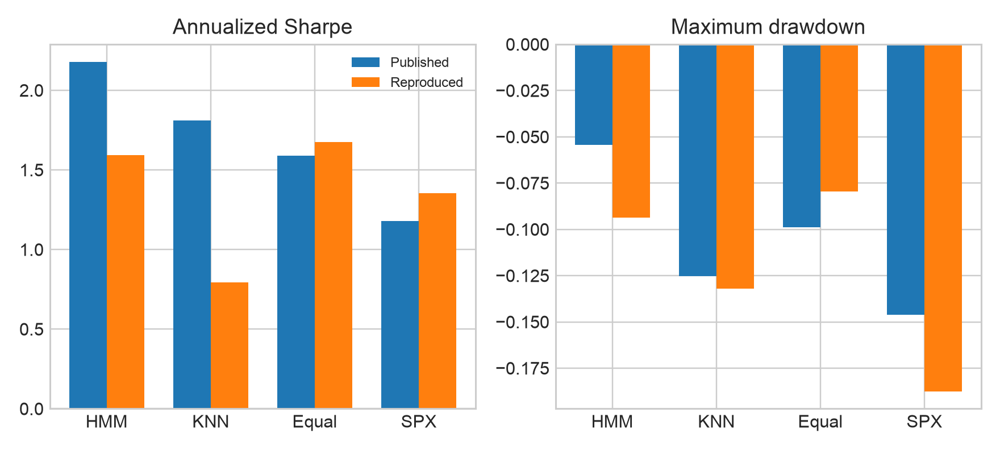
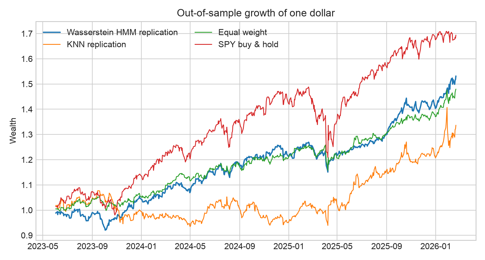
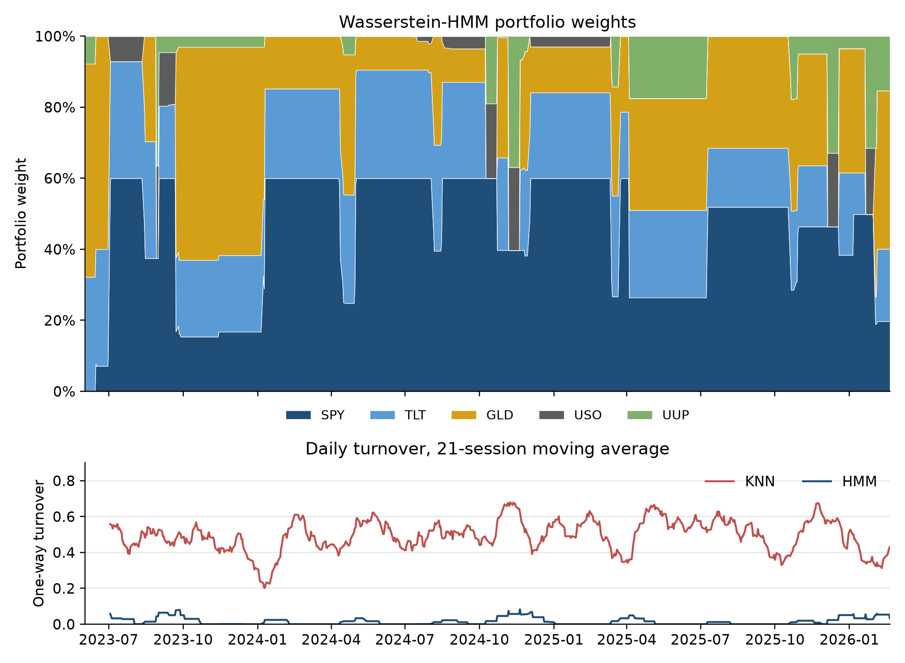
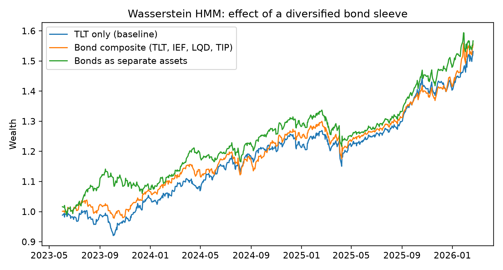

# Reproducing *Explainable Regime-Aware Investing*

**Manuel T.**[^1]

An independent implementation and reproducibility audit of:

> Amine Boukardagha, [*Explainable Regime Aware Investing*](https://arxiv.org/abs/2603.04441), arXiv:2603.04441v1 (2026).

This project reconstructs the paper's causal Wasserstein hidden Markov model (HMM), persistent regime templates, conditional return estimation, and transaction-penalized portfolio optimizer. It also implements the paper's K-nearest-neighbor (KNN) comparator and passive benchmarks.

### Abbreviations

| Abbreviation | Meaning |
|---|---|
| HMM | hidden Markov model: a model whose observed data are driven by an unobserved (latent) regime that switches over time |
| KNN | K-nearest neighbors: a non-parametric comparator that estimates return moments from the $`K`$ most similar past days |
| MVO | mean–variance optimization: choosing portfolio weights to trade off expected return against variance |
| ETF | exchange-traded fund |
| SPX | S&P 500 index (the paper's label for U.S. large-cap equities) |
| SPY | SPDR S&P 500 ETF, the tradable proxy for SPX |
| TLT | iShares 20+ Year Treasury Bond ETF (long-duration U.S. Treasuries) |
| IEF | iShares 7–10 Year Treasury Bond ETF (intermediate Treasuries) |
| LQD | iShares iBoxx Investment Grade Corporate Bond ETF |
| TIP | iShares TIPS Bond ETF (inflation-protected Treasuries) |
| GLD | SPDR Gold Shares ETF |
| USO | United States Oil Fund ETF |
| UUP | Invesco DB U.S. Dollar Index Bullish Fund ETF |
| bp / bps | basis point(s); 1 bp = 0.01% |
| TO | one-way turnover: half the sum of absolute weight changes |
| OOS | out-of-sample |


The **architecture is reproducible**, but the paper's **headline performance is not independently reproducible from the published specification**.

- The reproduced HMM is much more stable than KNN: average one-way turnover is **0.0166 versus 0.4949**.
- The reproduced HMM Sharpe is **1.59**, not the published **2.18**.
- Equal weight reaches a reproduced Sharpe of **1.68** with a smaller drawdown than the HMM.
- After explicit 5-basis-point (bp) trading costs, HMM Sharpe is **1.57** and KNN Sharpe falls to **0.38**.

The robust finding is therefore **lower turnover and greater implementation stability**, not verified dominance over passive diversification.



## Published versus reproduced results

The out-of-sample (OOS) interval is 2023-06-02 through 2026-02-20, containing 682 sessions.

| Strategy | Published Sharpe | Reproduced Sharpe | Published max drawdown | Reproduced max drawdown | Reproduced total return |
|---|---:|---:|---:|---:|---:|
| Wasserstein HMM | 2.18 | **1.59** | -5.43% | **-9.35%** | 53.17% |
| KNN | 1.81 | **0.79** | -12.52% | **-13.20%** | 33.66% |
| Equal weight | 1.59 | **1.68** | -9.87% | **-7.96%** | 47.98% |
| SPX / SPY (S&P 500 index / its ETF) | 1.18 | **1.36** | -14.62% | **-18.76%** | 69.38% |

Primary results are gross because the target paper penalizes turnover inside the optimizer but does not clearly state whether its performance tables deduct realized costs.

| Strategy | Gross Sharpe | Net Sharpe at 5 bps | Gross return | Net return at 5 bps | Average turnover |
|---|---:|---:|---:|---:|---:|
| Wasserstein HMM | 1.59 | **1.57** | 53.17% | **52.31%** | 0.0166 |
| KNN | 0.79 | **0.38** | 33.66% | **12.91%** | 0.4949 |



## Model summary

### 1. Strictly causal features

For adjusted prices $`P_t`$, log returns are

```math
r_t = \log P_t - \log P_{t-1}.
```

The decision for session $`t`$ uses only information available through $`t-1`$:

```math
x_t =
\begin{bmatrix}
r_{t-1} \\
\sigma^{(60)}_{t-1} \\
m^{(20)}_{t-1}
\end{bmatrix}
\in \mathbb{R}^{3N},
```

where $`\sigma^{(60)}`$ is rolling volatility and $`m^{(20)}`$ is rolling mean return. This resolves a timing ambiguity in the source paper, which writes $`r_t`$ inside $`x_t`$ while also claiming that all inputs stop at $`t-1`$.

### 2. Predictive Gaussian HMM

Conditional on latent state $`z_t=k`$,

```math
x_t \mid z_t=k \sim \mathcal{N}(a_k,B_k),
\qquad
\Pr(z_t=j \mid z_{t-1}=i)=A_{ij}.
```

The state count is chosen from $`K\in\{2,3,4,5,6\}`$ using a penalized validation likelihood:

```math
S_t(K)
=
\frac{1}{|V_t|}\log p(X_{V_t}\mid X_{H_t\setminus V_t},K)
-\lambda_K q(K).
```

The model is refitted every 10 sessions and its order is reconsidered every 63 sessions.

### 3. Wasserstein template tracking

Repeated HMM estimation can permute state labels. Each fitted Gaussian component is therefore assigned to the nearest persistent template using

```math
W_2^2\!\left(\mathcal{N}(a_1,B_1),\mathcal{N}(a_2,B_2)\right)
=
\|a_1-a_2\|_2^2
+
\mathrm{tr}\!\left[
B_1+B_2-2\left(B_2^{1/2}B_1B_2^{1/2}\right)^{1/2}
\right].
```

The reproduction maintains six templates and updates their feature and return moments by exponential smoothing.

### 4. Template-conditioned asset moments

The paper does not specify how its $`3N`$-dimensional feature distributions become $`N`$-dimensional portfolio moments. This implementation makes that bridge explicit. With filtered posterior weight $`\xi_{s,k}`$,

```math
\widehat{\mu}_k
=
\frac{\sum_{s \lt t}\xi_{s,k}R_s}{\sum_{s \lt t}\xi_{s,k}},
```

and $`\widehat{\Sigma}_k`$ is a posterior-weighted covariance shrunk toward its diagonal. Template probabilities then produce

```math
\widehat{\mu}_t=\sum_{g=1}^{G}p_{t,g}\widehat{\mu}_g,
\qquad
\widehat{\Sigma}_t=\sum_{g=1}^{G}p_{t,g}\widehat{\Sigma}_g.
```

### 5. Transaction-aware allocation

Daily weights solve

```math
\begin{aligned}
\max_{w_t}\quad
&\widehat{\mu}_t^\top w_t
-\gamma w_t^\top\widehat{\Sigma}_t w_t
-\tau\|w_t-w_{t-1}\|_1 \\
\text{s.t.}\quad
&\mathbf{1}^\top w_t=1,
\qquad 0\leq w_{t,i}\leq w_{\max}.
\end{aligned}
```

The specification uses $`\gamma=3`$, $`\tau=10^{-4}`$, and $`w_{\max}=60\%`$. The $`L^1`$ turnover penalty is solved with an exact linear epigraph. Reported one-way turnover is

```math
\mathrm{TO}_t=\frac{1}{2}\|w_t-w_{t-1}\|_1.
```



## Data and assumptions

The paper supplies economic labels rather than executable ticker symbols. This reproduction uses:

| Paper label | ETF proxy | Interpretation |
|---|---|---|
| SPX | SPY | U.S. large-cap equities |
| BOND | TLT | Long-duration U.S. Treasuries |
| GOLD | GLD | Gold |
| OIL | USO | Oil |
| USD | UUP | U.S. dollar |

Adjusted closes come from Yahoo Finance. The complete common panel begins on 2007-03-01 because UUP is the last proxy to start trading.

Key assumptions are centralized in [`config.py`](src/wasserstein_hmm/config.py):

- full-covariance Gaussian HMM in standardized feature space;
- candidate orders from two through six states;
- six persistent Wasserstein templates;
- 126-session validation window;
- 50 KNN neighbors;
- long-only, fully invested portfolio with a 60% asset cap;
- deterministic random seed 7; and
- separate gross and 5-bp realized-cost results.

## Extension: a diversified bond sleeve instead of TLT alone

The paper's single BOND sleeve is proxied above by TLT, a 20+ year Treasury fund, which is a concentrated bet on long duration. To test whether that choice matters, [`bond_extension.py`](src/wasserstein_hmm/bond_extension.py) reruns the identical pipeline (same config, seed, and out-of-sample window) with three bond configurations:

- **TLT only**: the baseline above.
- **Bond composite**: BOND is a single daily-rebalanced equal-weight blend of TLT, IEF (7–10 year Treasuries), LQD (investment-grade credit), and TIP (inflation-protected Treasuries). The asset count stays at five.
- **Bonds as separate assets**: TLT, IEF, LQD, and TIP are four distinct assets alongside SPY, GLD, USO, and UUP (eight assets, 24 features), and the optimizer chooses among them.

| Bond configuration | HMM Sharpe | HMM max drawdown | HMM total return | HMM turnover | KNN Sharpe | Equal-weight Sharpe |
|---|---:|---:|---:|---:|---:|---:|
| TLT only (baseline) | 1.59 | -9.35% | 53.17% | 0.0166 | 0.79 | 1.68 |
| Bond composite | **1.79** | -9.56% | 55.63% | 0.0143 | 1.06 | 1.80 |
| Bonds as separate assets | 1.77 | **-9.01%** | **56.70%** | 0.0158 | 0.94 | 1.64 |



What this does and does not show:

- Diversifying the bond sleeve raises the HMM Sharpe from 1.59 to about 1.78 in both variants, with similar drawdowns and equally low turnover.
- The composite result should not be over-read: equal weight also improves (1.68 to 1.80) because the same better bond leg lifts every strategy, so the HMM still does not beat passive diversification there. With separate bond assets the HMM (1.77) does beat equal weight (1.64), but that comparison is not like-for-like because equal weight then holds four bond funds out of eight assets.
- With separate assets the optimizer nearly ignores the bond funds (average weights: TLT 6.3%, IEF 0.1%, LQD 0.0%, TIP 0.6%) and shifts toward UUP and USO instead. The gain there therefore comes mostly from the larger opportunity set and different conditional moments, not from holding a broad bond portfolio.
- This is one sample, one seed, and one 682-session window. It is an exploration, not a tuned or validated improvement. The primary results elsewhere in this document keep the TLT-only specification.

Run it with `uv run python -m wasserstein_hmm.bond_extension` (about three minutes; extra prices are cached in `data/bond_prices.csv`). Outputs are written to `results/bond_extension.json`.

## Why the exact result cannot be recovered

The paper omits choices that materially determine the result:

1. exact tickers and data snapshot;
2. train/test boundary and missing-data treatment;
3. feature scaling and HMM covariance type;
4. candidate state counts, validation length, refit schedule, and complexity penalty;
5. template initialization, smoothing rate, and collision handling;
6. the mapping from 15-dimensional feature moments to five-asset return moments;
7. optimizer risk aversion, turnover penalty, and maximum weight;
8. whether reported performance is gross or net of realized costs; and
9. random seeds and convergence controls.

The arXiv source bundle also contains an older result table, a newer table labeled in comments as `Commercial V2.0 Parametric`, and no executable implementation or data snapshot. Even the passive SPX benchmark does not reconcile under standard calculations on the apparent Yahoo test window.

## Repository contents

| Path | Purpose |
|---|---|
| [`src/wasserstein_hmm/config.py`](src/wasserstein_hmm/config.py) | All inferred assumptions and published targets |
| [`src/wasserstein_hmm/data.py`](src/wasserstein_hmm/data.py) | Yahoo download/cache and strictly lagged features |
| [`src/wasserstein_hmm/models.py`](src/wasserstein_hmm/models.py) | HMM fitting, order selection, Wasserstein distance, and templates |
| [`src/wasserstein_hmm/optimize.py`](src/wasserstein_hmm/optimize.py) | Exact long-only transaction-penalized mean–variance optimization (MVO) |
| [`src/wasserstein_hmm/backtest.py`](src/wasserstein_hmm/backtest.py) | HMM, KNN, and passive causal backtests |
| [`src/wasserstein_hmm/run.py`](src/wasserstein_hmm/run.py) | End-to-end experiment and artifact generation |
| [`src/wasserstein_hmm/report.py`](src/wasserstein_hmm/report.py) | Figures |
| [`src/wasserstein_hmm/bond_extension.py`](src/wasserstein_hmm/bond_extension.py) | Diversified-bond-sleeve experiment |
| [`src/wasserstein_hmm/make_latex_numbers.py`](src/wasserstein_hmm/make_latex_numbers.py) | Generates LaTeX macros from `results.json` |
| [`data/prices.csv`](data/prices.csv), [`data/bond_prices.csv`](data/bond_prices.csv) | Cached adjusted-close price panels (baseline assets; extra bond ETFs) |
| [`results/results.json`](results/results.json) | Machine-readable published targets and reproduced results |
| [`results/hmm_daily.csv`](results/hmm_daily.csv), [`results/knn_daily.csv`](results/knn_daily.csv) | Daily weights, returns, turnover (and regime / model order for the HMM) |
| [`paper/`](paper/) | Full LaTeX paper (`.tex`, generated `numbers.tex`, compiled [`paper.pdf`](paper/paper.pdf)) |
| [`figures/`](figures/) | Publication figures |
| [`tests/`](tests/) | Offline unit tests |

## Reproduce the experiment

```bash
uv sync
uv run python -m wasserstein_hmm.run --refresh-data   # omit the flag to reuse data/prices.csv
```

The first run downloads adjusted prices and caches them under `data/`. Subsequent runs reuse the cache unless `--refresh-data` is supplied.

Tests and lint:

```bash
uv run pytest -q
uv run ruff check .
```

## Build the LaTeX paper

```bash
uv run python -m wasserstein_hmm.make_latex_numbers
cd paper
tectonic explainable_regime_investing_replication.tex
mv explainable_regime_investing_replication.pdf paper.pdf
```

Every empirical value in the paper is regenerated from `results/results.json` into `paper/numbers.tex`; the result tables and prose are not maintained separately by hand.

## Interpretation

This reproduction supports a narrower claim than the paper's headline:

> Persistent parametric regimes can substantially stabilize conditional-moment portfolio construction relative to an unsmoothed daily KNN estimator.

It does **not** independently establish that this Wasserstein-HMM implementation delivers superior risk-adjusted returns to equal-weight diversification.

## Disclaimer

This repository is a methodological reproduction for research purposes. It is not investment advice, a recommendation, or evidence of future returns. Backtests are sensitive to data, assumptions, costs, and implementation choices.

[^1]: AI assistance was used in creating this document.
