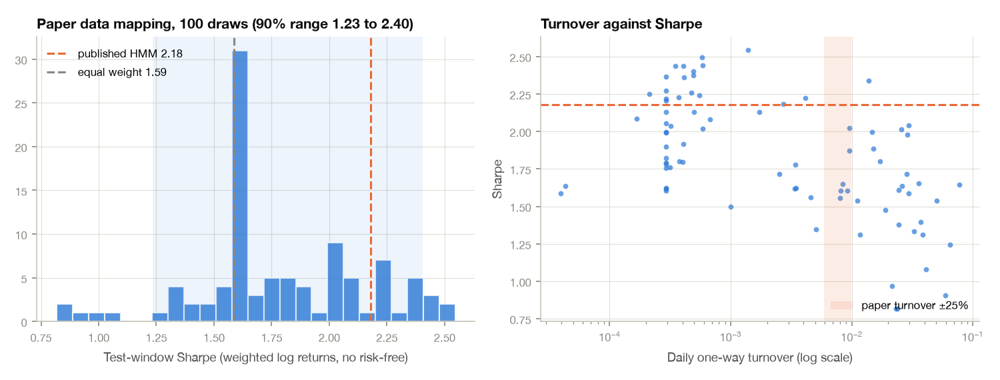

# Can the paper's numbers be reached by tuning what it leaves unstated?

*Last updated: 2026-09-30. Pre-registration: [`PLAN.md`](PLAN.md). Source audit:
[`paper_hints.md`](paper_hints.md). Measurement conventions: [`conventions/FINDINGS.md`](conventions/FINDINGS.md).*

The paper (Boukardagha 2026, arXiv:2603.04441) reports a Wasserstein-HMM Sharpe of **2.18**, max
drawdown −5.43% and daily turnover 0.0079, for June 2023 to February 2026. The replication got
1.59. This folder varies every parameter the paper does not state (16 of them, plus the data
mapping and the regime covariance estimator) to see which results plausible readings of the
paper produce. It adds up to 838 backtests.

## Answer in brief

- **Plausible settings give a wide range of Sharpes, and 2.18 falls inside it, near the top.**
  With the paper's own data mapping, 100 random settings put the middle 90% of Sharpes between **1.23 and 2.40**
  (median 1.65). 19% of them reach 2.18. On the replication's data the range is 1.18 to 2.38 over
  200 settings, and 15% reach 2.18.
- **Settings that trade like the paper do not earn like the paper.** The one setting that matches
  both the paper's turnover and its drawdown, rerun over 20 seeds, trades 0.0080 a day (paper: 0.0079)
  with a −6.5% drawdown, and has a Sharpe of **1.70** (90% of seeds between 1.30 and 2.13). Only 1 seed
  in 20 reaches 2.18.
- **Every Sharpe above about 2.2 comes from a portfolio that barely trades.** Those draws use a turnover penalty of
  0.0005–0.001 and trade less than 0.001 a day, a tenth of the paper's rate. They settle
  early on a mix with little oil and a lot of gold, and then hold it.
- **The paper's own average allocation explains its Sharpe without any timing.** Holding the
  paper's reported average weights (SPX 0.26, bonds 0.22, gold 0.22, oil 0, dollar 0.29) fixed
  every day gives a Sharpe of **2.34** on the paper's data, above the published 2.18. Across all
  draws, the model's day-to-day timing *lowers* Sharpe relative to holding its own average mix
  (by −0.16 on average; timing helps in only 20% of draws).
- **Choosing settings on earlier data does not carry over.** Tuning-window and test-window Sharpe
  have a rank correlation of only 0.15. The draw with the best tuning Sharpe, rerun over 20 seeds on the paper's
  data, averages 1.89 ± 0.46. That is higher than baseline, but only because it is one of the
  barely-trading settings.
- **The random seed alone moves the Sharpe by about ±0.3.** Seed-to-seed standard deviation is 0.17 to 0.46
  depending on the settings, as large as most parameter effects.

**Conclusion.** The paper's 2.18 is *reachable* but not *reproducible*. About one plausible reading in
five gets there. The readings that do are near-static portfolios whose return comes from holding
gold and no oil during a gold rally, not from regime timing. The readings that reproduce the paper's
trading behaviour land around 1.7, which is roughly the equal-weight benchmark (1.59).



## 1. Data and measurement

Stage 1 ([`conventions/`](conventions/FINDINGS.md)) searched 69,120 measurement conventions for
the one that reproduces the paper's *passive* benchmarks. The passive benchmarks have no model
parameters, so fitting them cannot overfit the model. The paper's source files pin it down: ^GSPC
(price index) for SPX, **IEF** for bonds, weighted daily log returns, √252, no risk-free rate, and
5 June 2023 to 19 February 2026 (680 sessions). This mapping gives SPX 1.175 (paper 1.18) and equal weight 1.588 (paper 1.59).
No definition reproduces both published drawdowns, so drawdown is a weak target.

## 2. One parameter at a time (replication data, 5 seeds each)

Baseline: the replication's settings, 20 seeds, Sharpe **1.64 ± 0.17** (range 1.37 to 1.91).

| Parameter | Replication value | Most favourable value | Sharpe there | Turnover there |
|---|---|---|---:|---:|
| turnover_penalty | 0.0001 | 0.0005 | **2.15** | 0.0009 |
| momentum_window | 20 (stated) | 10 | 1.91 | 0.0205 |
| volatility_window | 60 (stated) | 20 | 1.87 | 0.0157 |
| risk_aversion | 3 | 10 | 1.83 | 0.0101 |
| max_weight | 0.6 | 0.4 | 1.82 | 0.0120 |
| complexity_penalty | 0.002 | 0.005 | 1.80 | 0.0082 |
| validation_days | 126 | 252 | 1.78 | 0.0121 |
| cov_type | full | diag | 1.77 | 0.0134 |
| template_count | 6 | 3 | 1.75 | 0.0132 |

Two standard errors of a 5-seed mean are about ±0.15. Several parameters clear that bar by a
little (+0.16 to +0.28). The turnover penalty moves Sharpe by +0.52, about twice as much as any
other. The two feature windows are *stated* in the paper (60 and 20 days), so their rows show sensitivity, not
legitimate tuning. A penalty of 0.01 freezes the weights at equal weight (1.68 with zero spread across
seeds). Full table: `results/analyze.out`. Figure: `figures/oat.png`.

## 3. Pre-registered decision rules

| Rule | Replication data (200 draws) | Paper data mapping (100 draws) |
|---|---|---|
| **R1** 5th / 50th / 95th percentile Sharpe | 1.18 / 1.72 / 2.38 | **1.23 / 1.65 / 2.40** |
| R1 share with Sharpe ≥ 2.18 | 15% | 19% |
| R1 max drawdown, 5th to 95th percentile | −12.5% to −5.0% | −13.3% to −3.7% |
| R1 turnover, 5th to 95th percentile | 0 to 0.044 | 0 to 0.039 |
| **R2** draws matching turnover ±25% *and* drawdown ±20% | 0 | 1 (Sharpe 1.65) |
| R2, turnover alone (exploratory) | – | 6, Sharpe 1.55 to 2.02 (mean 1.72) |
| **R2b** Sharpe of the 10 draws closest to the paper's average allocation | – | mean 2.17, median 2.31 |
| **R3** best tuning-window draw → test Sharpe | 2.30 (ρ tune vs test = 0.15) | – |
| Best test-window draw (deflated Sharpe probability*) | 2.45 (0.99) | 2.55 (0.99) |

\*The Deflated Sharpe Ratio (Bailey & López de Prado 2014) here is the probability that the best
draw's true Sharpe is above *zero* after allowing for the number of trials. It says the best draw
is not pure noise. It does not say the best draw beats equal weight.

R2b: the draws closest to the paper's average allocation have high Sharpe, but 8 of those 10 trade
less than 0.001 a day. Allocation distance and Sharpe have a rank correlation of −0.56: the closer a
draw's average mix is to the paper's, the higher its Sharpe.

## 4. R4: the chosen settings, rerun over 20 seeds on the paper's data

| Settings | Sharpe mean ± sd | 90% of seeds | Seeds ≥ 2.18 | Max drawdown | Turnover |
|---|---:|---|---:|---:|---:|
| Paper (published) | 2.18 | | | −5.43% | 0.0079 |
| **R4-R2**: matches paper turnover and drawdown (E4 draw 53) | **1.70 ± 0.32** | 1.30 to 2.13 | 1 / 20 | −6.5% | **0.0080** |
| R4-R3: best on tuning window (joint draw 118) | 1.89 ± 0.46 | 1.42 to 2.42 | 7 / 20 | −7.0% | 0.0005 |
| R4-x66 (exploratory): near paper on turnover *and* allocation | 1.83 ± 0.10 | 1.69 to 1.96 | 0 / 20 | −5.5% | 0.0118 |
| Equal weight, paper data | 1.59 | | | | |

The R2 reconstruction reproduces the paper's turnover almost exactly, and its drawdown roughly.
Its Sharpe, though, sits about 0.5 below the paper's, and 19 of 20 seeds fall short.

## 5. Stage E: the paper's data mapping with the replication's settings

| Variant | Seeds | Sharpe mean ± sd | Turnover |
|---|---:|---:|---:|
| E1: paper data mapping, log returns | 10 | 1.68 ± 0.31 | 0.019 |
| E2: + the paper's schedule (refit daily, choose K weekly) | 5 | 1.66 ± 0.21 | 0.051 |
| E3: + Ledoit–Wolf regime covariances | 5 | 1.81 ± 0.38 | 0.017 |

Following the paper's pseudocode literally (E2) makes turnover six times *worse* than the paper's.
The published turnover therefore implies a turnover penalty larger than the replication's.

## 6. Exploratory: does the timing add anything? (added after the results)

*This test was not pre-registered.* For each draw, its "static twin" holds that draw's own
average test-window weights every day. That uses hindsight, so the twin is an attribution, not a
strategy. The "day-1" twin holds the first day's weights, which is implementable.

| Draw turnover | Draws (paper data) | Model Sharpe | Static twin | Day-1 twin | Timing effect |
|---|---:|---:|---:|---:|---:|
| < 0.001 | 56 | 1.90 | 1.92 | 1.70 | −0.01 |
| 0.001–0.005 | 10 | 1.89 | 1.97 | 1.92 | −0.09 |
| 0.005–0.02 (paper: 0.0079) | 14 | 1.71 | 2.01 | 1.91 | −0.30 |
| > 0.02 | 20 | 1.43 | 1.95 | 1.67 | −0.52 |

The replication data gives the same pattern (timing effect −0.10 on average; positive in 27% of draws).
**The more the model trades, the more it loses relative to holding its own average mix.** On
the paper's data, the individual assets' Sharpes were: gold 1.81, SPX 1.17, IEF 0.51, UUP 0.48,
oil 0.30. A mix heavy in gold with no oil did well over this window whether or not it was timed. Results:
`results/static.json`, `results/static_twins_*.csv`.

## 7. KNN comparator

The paper reports a KNN Sharpe of 1.81 with turnover 0.567. Under the paper's data mapping, 10 to 200
neighbours give 0.62 to 1.13 (turnover 0.38 to 0.54). On the replication's data, KNN Sharpe exceeds 1.6 only
with a turnover penalty of 0.003 or more (Sharpe 1.95 at turnover 0.008, contradicting the paper's 0.567)
or with a 60-day momentum window (1.61), which contradicts the paper's stated 20 days. **The KNN result is not reproduced under any setting tried.**

## Caveats

- One market history (680 days). Seeds and settings vary; the market path does not. The
  i.i.d. standard error of a 680-day Sharpe near 2 is about ±0.6, so even the paper's own 2.18 is a
  noisy number.
- The grid is a set of *plausible* values, not a prior. The percentages above are shares of this grid, not
  probabilities about what the author did.
- Everything is gross of costs.
- Section 6 and the turnover-only row of R2 are exploratory, added after seeing results.

## Reproduce

From this folder (the engine reuses `../paper-replication`'s package and virtual environment):

```sh
export PYTHONPATH=src:../paper-replication/src
PY=../paper-replication/.venv/bin/python
$PY -m ptune.sweep oat     # 230 runs, ~1 h on 9 workers; skips finished runs
$PY -m ptune.sweep knn     # 22 runs
$PY -m ptune.sweep joint   # 400 runs, ~1 h
$PY -m ptune.sweep paper   # 125 runs, ~40 min
$PY -m ptune.sweep r4      # 60 runs, ~15 min
$PY -m ptune.analyze       # tables -> results/analysis.json, figures/
$PY -m ptune.static        # section 6
$PY -m pytest -q tests
```

Per-run daily returns, turnover and weights are in `results/runs/<key>.csv` (69 MB), indexed by
`results/runs.jsonl`.
